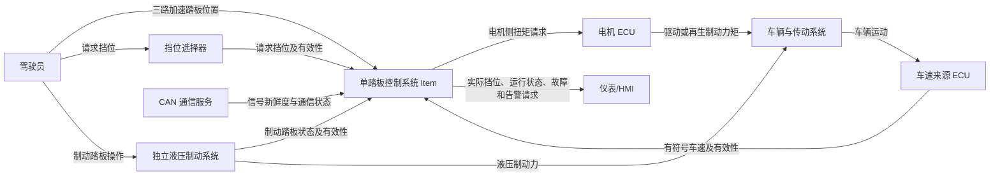

# 单踏板控制系统项目定义

## 1. 文档信息

| 项目 | 内容 |
| --- | --- |
| 文档名称 | 单踏板控制系统项目定义 |
| 文档标识 | OPC-ITEM-DEF-001 |
| 项目名称 | One Pedal Controller |
| 文档版本 | 1.0 |
| 文档状态 | Draft（待项目评审批准） |
| 适用对象 | 电动或混合动力乘用车单踏板控制功能 |
| 适用开发阶段 | ISO 26262 概念阶段 |
| 后续工作产品 | HARA、Safety Goals、FSC、FSR、TSC、TSR、SSR、系统架构、软件模型和验证计划 |

### 1.1 修订记录

| 版本 | 日期 | 修订内容 |
| --- | --- | --- |
| 1.0 | 2026-08-05 | 建立完整项目范围，统一功能边界、接口、运行模式、扭矩口径和外部依赖 |

### 1.2 文档目的

本文档定义单踏板控制系统 Item 的预期用途、功能范围、系统边界、外部接口、运行模式、运行环境、外部依赖和安全相关假设。本文档是危害分析与风险评估（HARA）、功能安全概念（FSC）、技术安全概念（TSC）、系统和软件需求、模型设计及验证活动的统一输入。

本文档只定义 Item 应承担的车辆级和系统级功能，不分配 ASIL，不建立 Safety Goal，不规定具体 Simulink 模块、Stateflow 状态或代码实现。ASIL、Safety Goal、安全状态和 FTTI 由后续 HARA 与 FSC 确定。

### 1.3 参考资料

| 标识 | 资料 |
| --- | --- |
| REF-001 | ISO 26262-3:2018, Road vehicles — Functional safety — Part 3: Concept phase |
| REF-002 | 项目原始文档 `Item definition & HARA for One Pedal Control.md` |
| REF-003 | 项目控制器说明 `Controller_Description.md` |
| REF-004 | 项目现有 Controller、Plant、Harness 和安全机制模型 |

### 1.4 术语与缩写

| 缩写/术语 | 含义 |
| --- | --- |
| Item | 本项目开展功能安全生命周期活动的对象，即单踏板控制系统 |
| OPC | One Pedal Controller，单踏板控制器 |
| ECU | Electronic Control Unit，电子控制单元 |
| EM | Electric Motor，电机 |
| CAN | Controller Area Network，控制器局域网 |
| HMI | Human-Machine Interface，人机界面 |
| HARA | Hazard Analysis and Risk Assessment，危害分析与风险评估 |
| FSC | Functional Safety Concept，功能安全概念 |
| TSC | Technical Safety Concept，技术安全概念 |
| FTTI | Fault Tolerant Time Interval，故障容错时间间隔 |
| 正扭矩 | 驱动车辆向前运动的电机侧扭矩请求 |
| 负扭矩 | 驱动车辆倒车或实施再生制动的电机侧扭矩请求，具体含义由当前挡位决定 |
| 请求挡位 | 驾驶员通过挡位选择器提出的挡位 |
| 实际挡位 | Item 根据安全切换条件接受并输出的挡位 |
| 安全状态 | 后续 HARA/FSC 确定的、用于降低不可接受风险的 Item 状态 |
| 降级运行 | 检测到可容忍故障后，在限制功能或性能的条件下继续运行 |

## 2. Item 概述

### 2.1 Item 名称

本 Item 名称为“单踏板控制系统”（One Pedal Control System）。

### 2.2 Item 目标

单踏板控制系统用于电动或混合动力车辆。系统根据驾驶员加速踏板输入、制动踏板状态、自动变速器挡位选择和车辆速度，计算并输出电机侧扭矩请求，使车辆在 D 挡下实现传统驱动，在 B 挡下通过同一加速踏板实现驱动和再生制动。

Item 同时负责挡位切换约束、低速停车保持所需的扭矩控制、输入信号合理性检查、故障状态管理、降级运行请求以及驾驶员告警请求。Item 不直接驱动电机、不直接控制液压制动、不直接执行机械驻车锁止。

### 2.3 预期用途

Item 用于具备以下条件的量产概念电动或混合动力乘用车：

- 车辆具有可接收电机侧扭矩请求的电机 ECU；
- 车辆具有独立的液压制动系统，驾驶员可以随时通过制动踏板直接减速或停车；
- 车辆提供三路加速踏板位置测量；
- 车辆通过 CAN 或等效车载通信向 Item 提供制动踏板状态、请求挡位和车速；
- 车辆提供 P、R、N、D、B 五种请求挡位；
- 车辆 HMI 能够显示实际挡位、降级状态和故障告警；
- 电机和传动系统支持正向驱动、反向驱动和再生制动扭矩。

### 2.4 使用者与利益相关方

| 角色 | 与 Item 的关系 |
| --- | --- |
| 驾驶员 | 通过加速踏板、制动踏板和挡位选择器操作车辆，并接收挡位及故障提示 |
| 整车控制系统 | 向 Item 提供车辆状态并接收 Item 状态与诊断信息 |
| 电机 ECU | 接收 Item 输出的扭矩请求并执行电机控制 |
| 制动系统 | 独立执行驾驶员制动踏板请求，不受 Item 扭矩控制替代 |
| HMI/仪表系统 | 显示实际挡位、故障状态和驾驶员告警 |
| 系统与软件开发人员 | 根据本文档开展需求、架构、模型和代码开发 |
| 功能安全人员 | 根据本文档开展 HARA、安全概念、安全分析和确认措施 |
| 验证人员 | 根据本文档建立测试环境、测试场景和验收条件 |

## 3. Item 边界

### 3.1 系统上下文

### 3.2 Item 内部功能

Item 包含以下功能：

1. 接收和预处理三路加速踏板位置；
2. 检查加速踏板信号范围、通道一致性和可信度；
3. 接收制动踏板状态、请求挡位、车辆速度和通信有效性信息；
4. 检查 CAN 应用信号的新鲜度、范围、枚举合法性和可用状态；
5. 管理 P、R、N、D、B 请求挡位与实际挡位；
6. 根据车速和制动踏板条件约束危险挡位切换；
7. 在 D 挡计算正向驱动扭矩；
8. 在 R 挡计算反向驱动扭矩；
9. 在 B 挡根据踏板中性点计算再生制动或正向驱动扭矩；
10. 在接近零速时抑制再生制动引起的反向运动；
11. 在 B 挡实现规定范围内的电机扭矩停车保持；
12. 在制动踏板踩下时取消 Item 产生的驱动扭矩；
13. 对最终扭矩请求执行方向约束、限幅和变化率限制；
14. 管理正常、降级、安全和恢复运行状态；
15. 输出实际挡位、诊断状态、运行状态和驾驶员告警请求。

### 3.3 Item 外部系统

以下对象不属于 Item，但与 Item 存在接口或安全相关依赖：

| 外部对象 | 外部对象责任 | Item 与其接口 |
| --- | --- | --- |
| 三路踏板传感器硬件 | 测量物理踏板位置并提供电气信号 | Item 接收三个归一化踏板位置及通道有效性信息 |
| 挡位选择器 | 获取驾驶员 P/R/N/D/B 请求 | Item 接收请求挡位及有效性信息 |
| 液压制动系统 | 根据驾驶员制动踏板操作产生独立机械制动力 | Item 只接收制动踏板是否踩下的信息 |
| 车速来源 ECU | 测量或估算有符号车辆速度 | Item 接收车速及有效性信息 |
| CAN 通信服务 | 接收、校验和传递车辆网络报文 | Item 使用解码后的信号、新鲜度和通信状态 |
| 电机 ECU | 将有效扭矩请求转换为电机电流和实际电机扭矩 | Item 输出电机侧扭矩请求和有效性状态 |
| 仪表/HMI | 显示实际挡位并向驾驶员发出声光警告 | Item 输出显示状态和告警请求 |
| 机械驻车机构 | 在 P 挡执行车辆机械锁止 | Item 只管理实际挡位和零扭矩请求 |
| 电池管理系统 | 限制可用驱动和再生功率 | Item 接收或由电机 ECU 应用可用扭矩限制 |
| ABS/ESC/牵引力控制 | 在附着极限条件下管理车轮滑移和稳定性 | 其扭矩限制优先级高于 Item 的驾驶员扭矩请求 |

### 3.4 验证环境与产品边界

Simulink Vehicle Plant、Driver、故障注入模块、Signal Builder、Test Harness、测试用例和基线数据属于验证环境，不属于量产 Item。验证环境用于向 Item 提供可重复输入、模拟车辆纵向响应并检查 Item 输出，不得被当作安全机制或产品实现的一部分。

## 4. 功能描述

### 4.1 通用功能规则

1. Item 的扭矩输出统一定义为电机侧扭矩，单位为 Nm；
2. 正扭矩表示前进驱动方向，负扭矩表示反向电机方向；
3. 在 R 挡，负扭矩用于车辆倒车；
4. 在 B 挡且车辆向前运动时，负扭矩用于再生制动；
5. Item 的正常控制周期为 10 ms；
6. Item 输出扭矩范围为 −80 Nm 至 +80 Nm；
7. D 挡和 B 挡最大正向驱动扭矩为 +80 Nm；
8. R 挡最大反向驱动扭矩为 −40 Nm；
9. B 挡最大再生制动扭矩为 −80 Nm；
10. 传动系统总传动比采用 12，电机侧扭矩经传动系统转换为车轮侧扭矩；
11. 制动踏板踩下时，Item 不得输出正向或反向驱动扭矩；
12. N 挡和 P 挡的 Item 扭矩请求为 0 Nm；
13. Item 不得通过再生制动使车辆越过零速后继续向反方向运动；
14. 所有挡位切换和故障恢复不得产生不可控的扭矩阶跃。

### 4.2 初始化状态

控制器上电或复位后进入初始化状态并执行以下行为：

- 将扭矩请求初始化为 0 Nm；
- 将实际挡位初始化为 P；
- 将运行状态初始化为 Initialization；
- 检查三路踏板输入、制动踏板状态、请求挡位、车速和通信状态；
- 在关键输入未建立有效状态前保持 0 Nm 扭矩请求；
- 关键输入全部有效且满足启动条件后进入 Normal Operation；
- 关键输入无效时进入后续安全概念规定的 Degraded Operation 或 Safe State。

### 4.3 P 挡功能

- 实际挡位为 P；
- Item 输出 0 Nm 扭矩请求；
- 机械驻车锁止由外部驻车机构执行；
- 从 P 挡退出时，制动踏板必须被踩下；
- 从 P 挡切换至 R、N、D 或 B 时，车辆速度绝对值必须小于 5 km/h；
- 不满足切换条件时保持 P 挡并输出挡位请求未接受状态。

### 4.4 R 挡功能

- R 挡用于车辆反向运动；
- 有效踏板位置从 0 增加至 1 时，Item 请求扭矩从 0 Nm 线性减小至 −40 Nm；
- 制动踏板踩下时扭矩请求为 0 Nm；
- 从 N 或 P 进入 R 挡时，制动踏板必须踩下且车速绝对值小于 5 km/h；
- 车辆处于明显正向运动时不得接受 R 挡；
- R 挡切换至 N 挡可随时请求，接受后立即将扭矩请求平滑降至 0 Nm；
- R 挡切换至 P、D 或 B 必须先满足接近静止和制动踏板条件；
- R 挡不实现主动倒车蠕行，踏板位置为 0 时扭矩请求为 0 Nm。

### 4.5 N 挡功能

- 实际挡位为 N；
- Item 输出 0 Nm 扭矩请求；
- N 挡允许在任意车辆速度下被请求；
- 进入 N 挡后车辆可在外部阻力和制动系统作用下自由滑行；
- Item 不通过电机扭矩主动保持车速或车辆静止；
- 从 N 挡进入 P、R、D 或 B 时，制动踏板必须踩下且车速绝对值小于 5 km/h。

### 4.6 D 挡功能

- D 挡用于传统正向驱动；
- 有效踏板位置从 0 增加至 1 时，Item 请求扭矩从 0 Nm 线性增加至 +80 Nm；
- 踏板位置为 0 时扭矩请求为 0 Nm；
- D 挡不实现主动蠕行，车辆松开制动踏板后的运动由道路坡度、传动阻力和外部系统决定；
- 制动踏板踩下时，Item 将驱动扭矩请求平滑降至 0 Nm；
- 从 N 或 P 进入 D 挡时，制动踏板必须踩下且车速绝对值小于 5 km/h；
- D 与 B 之间允许在车辆向前运动时直接切换，但必须对扭矩请求执行变化率限制，避免扭矩突变；
- 车辆处于明显反向运动时不得接受 D 挡。

### 4.7 B 挡功能

- B 挡用于单踏板正向驱动和再生制动；
- 踏板中性点为归一化踏板行程的 1/3；
- 当踏板位置 $p$ 满足 $0\le p\le 1/3$ 时，Item 按下式请求再生制动扭矩：

$$
T_{req}=-80\left(1-3p\right)\ \mathrm{Nm}
$$

- 当踏板位置 $p$ 满足 $1/3<p\le1$ 时，Item 按下式请求正向驱动扭矩：

$$
T_{req}=120\left(p-\frac{1}{3}\right)\ \mathrm{Nm}
$$

- 踏板完全松开时请求 −80 Nm；
- 踏板位于中性点时请求 0 Nm；
- 踏板完全踩下时请求 +80 Nm；
- 制动踏板踩下时，Item 的电机扭矩请求为 0 Nm，由独立液压制动系统执行驾驶员制动；
- 当车辆速度接近 0 km/h 时，Item 必须逐步退出固定再生制动映射，并进入停车保持控制；
- 停车保持控制以 0 km/h 为目标，不得使车辆越过零速后向反方向运动；
- B 挡停车保持功能适用于道路坡度绝对值不超过 10%；超过该范围时，驾驶员必须使用制动踏板或驻车制动；
- 当驾驶员将踏板踩过中性点并请求正向驱动时，Item 平滑退出停车保持控制；
- D 与 B 之间允许直接切换，并对扭矩请求执行变化率限制。

### 4.8 挡位切换规则

| 当前实际挡位 | 请求挡位 | 接受条件 |
| --- | --- | --- |
| P | N/R/D/B | 制动踏板踩下且 $|v|<5$ km/h |
| R | N | 随时允许，扭矩平滑降至 0 Nm |
| R | P/D/B | 制动踏板踩下且 $|v|<5$ km/h |
| N | P/R/D/B | 制动踏板踩下且 $|v|<5$ km/h |
| D | N | 随时允许，扭矩平滑降至 0 Nm |
| D | B | 车辆未明显反向运动，执行平滑扭矩转换 |
| D | P/R | 制动踏板踩下且 $|v|<5$ km/h |
| B | N | 随时允许，扭矩平滑降至 0 Nm |
| B | D | 车辆未明显反向运动，执行平滑扭矩转换 |
| B | P/R | 制动踏板踩下且 $|v|<5$ km/h |

不满足接受条件时，Item 保持当前实际挡位，并将“请求挡位未接受”状态提供给 HMI/诊断接口。

## 5. Item 运行状态

### 5.1 Initialization

Item 正在完成上电初始化、输入有效性检查和内部状态初始化。该状态下扭矩请求为 0 Nm。

### 5.2 Normal Operation

所有安全相关输入满足有效性和可信度条件，Item 按 P/R/N/D/B 功能规则执行正常扭矩控制。

### 5.3 Degraded Operation

Item 检测到后续安全概念允许容忍的单一故障，使用仍然可信的信息继续受限运行。降级运行的允许挡位、速度、扭矩、告警、锁存和恢复条件由 FSC、TSC 及其安全需求确定。

### 5.4 Safe State

Item 检测到无法支持安全扭矩控制的故障时进入 Safe State。Safe State 的扭矩行为、挡位行为、驾驶员告警和 FTTI 由 HARA 与 FSC 确定。任何 Safe State 均不得主动产生不可控驱动扭矩。

### 5.5 Recovery

Item 从降级或安全状态恢复正常运行前，必须确认故障条件已经消失、输入重新可信、挡位及制动踏板条件允许恢复，并采用受控状态转换防止扭矩阶跃。需要锁存的故障必须通过有效复位请求或新的驾驶循环清除。

## 6. 外部接口定义

### 6.1 输入接口

| 接口 ID | 信号名称 | 来源 | 单位 | 正常范围/取值 | 方向与语义 | 更新周期 |
| --- | --- | --- | --- | --- | --- | --- |
| OPC-IN-001 | `PedalPosition_A` | 踏板传感器 A | 1 | 0.0～1.0 | 0 为完全松开，1 为完全踩下 | 10 ms |
| OPC-IN-002 | `PedalPosition_B` | 踏板传感器 B | 1 | 0.0～1.0 | 0 为完全松开，1 为完全踩下 | 10 ms |
| OPC-IN-003 | `PedalPosition_C` | 踏板传感器 C | 1 | 0.0～1.0 | 0 为完全松开，1 为完全踩下 | 10 ms |
| OPC-IN-004 | `BrakePedalPressed` | 制动系统/CAN | Boolean | 0/1 | 1 表示制动踏板踩下 | 10 ms |
| OPC-IN-005 | `RequestedTransmissionState` | 挡位选择器/CAN | Enum | P/R/N/D/B | 驾驶员请求挡位 | 10 ms |
| OPC-IN-006 | `VehicleSpeed_kph` | 车速来源 ECU/CAN | km/h | −60～+240 | 正值表示前进，负值表示倒车 | 10 ms |
| OPC-IN-007 | `BrakeSignalValid` | CAN 通信服务 | Boolean | 0/1 | 1 表示制动踏板信号有效且新鲜 | 10 ms |
| OPC-IN-008 | `SelectorSignalValid` | CAN 通信服务 | Boolean | 0/1 | 1 表示请求挡位信号有效且新鲜 | 10 ms |
| OPC-IN-009 | `SpeedSignalValid` | CAN 通信服务 | Boolean | 0/1 | 1 表示车速信号有效且新鲜 | 10 ms |
| OPC-IN-010 | `PedalSensorValid_A` | 踏板输入服务 | Boolean | 0/1 | 通道 A 电气诊断状态 | 10 ms |
| OPC-IN-011 | `PedalSensorValid_B` | 踏板输入服务 | Boolean | 0/1 | 通道 B 电气诊断状态 | 10 ms |
| OPC-IN-012 | `PedalSensorValid_C` | 踏板输入服务 | Boolean | 0/1 | 通道 C 电气诊断状态 | 10 ms |
| OPC-IN-013 | `ResetRequest` | 诊断/驾驶循环管理 | Boolean | 0/1 | 请求清除允许复位的锁存故障 | 10 ms |
| OPC-IN-014 | `AvailableDriveTorque_Nm` | 电机 ECU/整车控制器 | Nm | 0～80 | 当前允许的最大正向电机侧扭矩 | 10 ms |
| OPC-IN-015 | `AvailableRegenTorque_Nm` | 电机 ECU/电池管理系统 | Nm | −80～0 | 当前允许的最大再生制动能力 | 10 ms |

### 6.2 输出接口

| 接口 ID | 信号名称 | 目标 | 单位 | 范围/取值 | 语义 | 更新周期 |
| --- | --- | --- | --- | --- | --- | --- |
| OPC-OUT-001 | `TorqueRequest_Nm` | 电机 ECU | Nm | −80～+80 | 电机侧扭矩请求 | 10 ms |
| OPC-OUT-002 | `TorqueRequestValid` | 电机 ECU | Boolean | 0/1 | 扭矩请求是否允许执行 | 10 ms |
| OPC-OUT-003 | `ActualTransmissionState` | HMI/整车控制器 | Enum | P/R/N/D/B | Item 接受并执行的实际挡位 | 10 ms |
| OPC-OUT-004 | `OperatingState` | HMI/诊断 | Enum | Initialization/Normal/Degraded/Safe/Recovery | Item 当前运行状态 | 10 ms |
| OPC-OUT-005 | `PedalFaultStatus` | HMI/诊断 | Bit field/Enum | NoFault/A/B/C/Multiple/Untrusted | 踏板诊断结果 | 10 ms |
| OPC-OUT-006 | `CANFaultStatus` | HMI/诊断 | Bit field | Brake/Selector/Speed | CAN 应用信号故障状态 | 10 ms |
| OPC-OUT-007 | `ShiftRequestRejected` | HMI/诊断 | Boolean | 0/1 | 请求挡位因切换条件不满足而未接受 | 10 ms |
| OPC-OUT-008 | `WarningRequest` | HMI | Enum | None/Advisory/ServiceRequired/StopSafely | 驾驶员告警请求等级 | 10 ms |
| OPC-OUT-009 | `DegradedReason` | HMI/诊断 | Enum/Bit field | 按诊断定义 | 进入降级运行的原因 | 10 ms |
| OPC-OUT-010 | `SafeStateReason` | HMI/诊断 | Enum/Bit field | 按诊断定义 | 进入 Safe State 的原因 | 10 ms |

### 6.3 接口通用规则

- 所有物理量必须具有明确单位和符号约定；
- 所有枚举必须包含非法值或 Unknown 状态；
- 所有 CAN 来源信号必须具有新鲜度或有效性信息；
- 输入超出物理范围、枚举非法、数据超时或通信无效时不得作为正常控制输入使用；
- Item 输出的扭矩请求不得超过电机 ECU 和电池管理系统提供的可用扭矩限制；
- 通信信号的报文 ID、字节序、缩放、偏置、CRC、Alive Counter 和超时由后续接口控制文档定义；
- 软件数据类型、Bus 定义和标定参数由后续数据字典统一管理。

## 7. 运行环境与运行场景

### 7.1 车辆运行状态

Item 适用于以下车辆状态：

- 车辆静止；
- 车辆向前低速行驶；
- 车辆向前高速行驶；
- 车辆倒车；
- 车辆自由滑行；
- 车辆在道路坡度上静止或运动；
- 驾驶员正常加速、松开踏板再生制动和踩下制动踏板；
- 驾驶员提出合法或不合法的挡位切换请求；
- 输入信号正常、间歇故障、固定值故障、越界故障、不一致或丢失。

### 7.2 道路与交通环境

Item 的功能范围覆盖：

- 城市拥堵道路；
- 城市普通道路；
- 高速公路；
- 干燥道路；
- 湿滑道路；
- 上坡和下坡道路；
- 直线行驶、跟车、起步、停车、倒车和泊车过程。

ABS、ESC 和牵引力控制负责轮胎附着极限和车辆横向稳定性，Item 不单独保证低附着路面上的车轮稳定。

### 7.3 速度与坡度包络

| 项目 | 范围 |
| --- | --- |
| 设计输入车速范围 | −60～+240 km/h |
| 正常倒车运行范围 | 0～−45 km/h |
| 正常前进行驶范围 | 0～+230 km/h |
| 挡位方向切换允许速度 | $|v|<5$ km/h |
| B 挡停车保持车速区间 | $|v|\le0.2$ km/h |
| B 挡电机停车保持坡度 | 道路坡度绝对值不超过 10% |

### 7.4 物理与电气环境

Item 软件应能够部署于满足整车级环境要求的 ECU。ECU 温度、电压、电磁兼容、机械冲击、防水防尘和硬件随机失效能力由 ECU 硬件开发过程保证。软件功能在 MIL 环境中不直接模拟这些环境量，但相关影响必须通过接口失效、FMEA、DFA 和故障注入场景进行分析。

## 8. 外部依赖与安全相关假设

| 假设 ID | 假设内容 | 依赖对象 | 失效时的处理方向 |
| --- | --- | --- | --- |
| ASM-001 | 液压制动系统与 Item 的电机扭矩控制具有足够独立性，驾驶员可随时通过制动踏板实施机械制动 | 液压制动系统 | 在 HARA/DFA 中分析共同原因失效 |
| ASM-002 | 电机 ECU 在接口规定时间内执行有效扭矩请求，并拒绝无效或越界请求 | 电机 ECU | 建立扭矩接口监控和执行器安全需求 |
| ASM-003 | 车速正值表示前进、负值表示倒车，方向定义在所有系统中一致 | 车速来源 ECU | 通过接口验证和范围/方向合理性检查控制 |
| ASM-004 | 挡位选择器提供 P/R/N/D/B 和 Unknown，且其有效性可检测 | 挡位选择器 | 无效时禁止危险换挡并进入安全策略 |
| ASM-005 | 三路踏板传感器的机械和电气设计支持通道独立性分析 | 踏板传感器 | 通过 DFA 确认共享电源、地、ADC 和线束风险 |
| ASM-006 | CAN 通信服务提供信号新鲜度、超时、CRC/Alive Counter 或等效诊断结果 | CAN 通信服务 | 应用层拒绝无效信号并输出故障状态 |
| ASM-007 | HMI 能够在规定时间内显示实际挡位和执行告警请求 | 仪表/HMI | 建立 HMI TSR 和验证需求 |
| ASM-008 | 机械驻车机构负责 P 挡车辆锁止，Item 的零扭矩不能替代机械驻车 | 驻车机构 | Item 只输出实际 P 挡状态和零扭矩 |
| ASM-009 | ABS、ESC、牵引力控制和电机 ECU 可覆盖 Item 扭矩请求并执行更高优先级的稳定性限制 | 底盘与电机控制系统 | 定义扭矩仲裁接口和优先级 |
| ASM-010 | 电池管理系统或电机 ECU提供当前可用驱动和再生扭矩限制 | 电池/电机 ECU | Item 按可用扭矩执行动态限幅 |
| ASM-011 | 控制器任务以 10 ms 周期调度，任务超时和看门狗由平台基础软件监控 | ECU 平台 | 建立任务监控和超时安全需求 |
| ASM-012 | Item 上电时可获得确定的初始化和复位状态 | ECU 平台 | 初始化期间保持零扭矩和无效请求状态 |

## 9. 安全相关功能约束

以下约束是后续 HARA 和安全概念的输入，不代表已经完成 ASIL 分配：

1. Item 不得因输入、计算或状态管理故障产生非预期驱动扭矩；
2. Item 不得因输入、计算或状态管理故障产生非预期再生制动扭矩；
3. Item 不得请求与实际挡位方向不一致的驱动扭矩；
4. Item 不得允许再生制动使车辆越过零速后反向运动；
5. 制动踏板状态有效且被踩下时，Item 不得继续请求驱动扭矩；
6. 危险方向换挡必须受到车速和制动踏板条件约束；
7. 上电、复位、任务重启和故障恢复期间不得产生非预期扭矩；
8. 踏板信号不可信时不得继续使用不可信信号执行正常扭矩控制；
9. 车速信号不可信时不得继续执行依赖车速方向或零速判断的正常功能；
10. 请求挡位信号不可信时不得接受新的危险方向挡位；
11. Item 的最终扭矩请求必须执行方向限制、幅值限制、可用扭矩限制和变化率限制；
12. 检测到影响安全目标的故障时，Item 必须在后续 HARA 确定的 FTTI 内完成规定安全反应；
13. Item 必须向外部诊断和 HMI 提供足以识别当前故障及运行状态的信息；
14. 单点故障、多点故障、相关失效和潜伏故障必须在后续 FMEA、FTA 和 DFA 中分析；
15. 降级运行不得掩盖更严重的后续故障或阻止 Item 进入 Safe State。

## 10. 排除项

以下内容不属于本 Item 的设计实现范围：

- 液压制动力计算、ABS、ESC、牵引力控制和制动压力控制；
- 完整的再生制动与液压制动混合制动分配；
- 电机电流环、转矩闭环、逆变器控制和电机热保护；
- 电池荷电状态估算、充放电功率限制算法和电池热管理；
- 机械变速器、差速器和驻车锁的物理设计；
- 踏板传感器、车速传感器和挡位选择器硬件设计；
- CAN 驱动、网络管理、报文收发和底层协议栈实现；
- 仪表显示界面和声光执行器硬件设计；
- 车辆横向动力学、轮胎滑移和车身稳定性控制；
- 自动驾驶、驾驶辅助、碰撞避免和环境感知；
- 网络安全攻击、恶意报文和未经授权的诊断访问；
- 预期功能安全（SOTIF）问题；
- 车辆机械、热、电气和电磁兼容的实物验证；
- Vehicle Plant 和 Driver 模型的量产代码生成。

排除项仍可能构成 Item 的外部接口或安全相关依赖，并在 HARA、FSC、TSC、FMEA、FTA、DFA 和接口需求中进行处理。

## 11. 生命周期与运行转换

Item 生命周期包含：

1. ECU 无电；
2. ECU 上电与 Item 初始化；
3. 正常驾驶循环；
4. 降级运行或 Safe State；
5. 受控恢复；
6. ECU 下电；
7. 诊断和维修复位。

下电前 Item 应将扭矩请求置为 0 Nm，并向电机 ECU 撤销有效扭矩请求。新的驾驶循环不得在输入有效性尚未确认时恢复非零扭矩控制。

## 12. 验证环境边界

项目使用 Simulink/Stateflow 建立以下验证环境：

| 验证元素 | 用途 | 是否属于 Item |
| --- | --- | --- |
| Driver 模型 | 产生踏板、制动和挡位操作 | 否 |
| Vehicle Plant | 根据扭矩、阻力和坡度计算车速 | 否 |
| Test Harness | 连接输入、Item 和 Plant | 否 |
| 故障注入模块 | 注入踏板、CAN 和状态故障 | 否 |
| Controller 模型 | 实现 Item 软件功能 | 是 |
| 数据字典 | 定义 Item 接口、参数和类型 | 是 |
| Test Manager 测试 | 验证需求实现 | 否，属于验证证据 |

验证环境必须与 Item 接口定义保持一致，但不得把 Plant 或测试激励中的理想行为当作 Item 的外部安全保证。

## 13. 后续工作产品接口

本文档为后续工作提供以下输入：

| 后续工作产品 | 从本文档继承的内容 |
| --- | --- |
| HARA | Item 功能、边界、运行场景、外部依赖和安全约束 |
| FSC/FSR | Safety Goal、安全状态、功能安全措施和驾驶员告警的功能分解 |
| 系统架构/TSC/TSR | 外部对象、技术组件、接口、故障检测和反应分配 |
| FMEA/FTA/DFA | Item 功能、组件边界、外部依赖和潜在共同资源 |
| SSR | 软件接口、运行状态、扭矩规则、诊断和时序行为 |
| Controller Specification | 10 ms 周期、扭矩口径、模式和接口契约 |
| Plant Specification | 扭矩输入、车速输出、速度和坡度运行包络 |
| Test Plan | 正常模式、换挡、故障、降级、安全状态和恢复场景 |

## 14. 项目范围结论

本项目的产品 Item 是单踏板控制系统及其控制器软件。Item 接收三路踏板、制动踏板、请求挡位、车速、通信状态和可用扭矩信息，管理 P/R/N/D/B 挡位及正常、降级、安全和恢复运行状态，输出电机侧扭矩请求、实际挡位和诊断告警信息。

液压制动、电机 ECU、踏板硬件、车速来源、挡位选择器、CAN 底层通信、仪表、机械驻车机构和底盘稳定性控制均位于 Item 边界之外。Vehicle Plant、Driver、Harness 和测试资产属于验证环境，不属于量产 Item。

本文档统一采用 10 ms 控制周期、电机侧扭矩口径、+80 Nm 最大正向驱动扭矩、−40 Nm 最大倒车扭矩、−80 Nm 最大再生制动扭矩、1/3 踏板中性点、5 km/h 危险方向换挡阈值、0.2 km/h 停车保持进入阈值和 10% 停车保持坡度范围。上述定义是后续 HARA、安全需求、模型重构和测试设计的统一边界。
