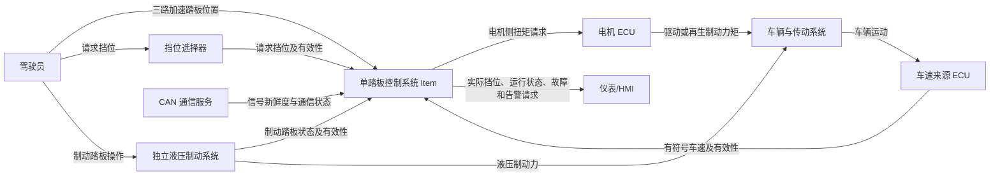

# 系统定义

## 零、介绍

| 项目         | 内容                                                         |
| ------------ | ------------------------------------------------------------ |
| 文档名称     | 单踏板控制系统项目定义                                       |
| 文档标识     | OPC-ITEM-DEF-001                                             |
| 项目名称     | One Pedal Controller                                         |
| 文档版本     | 1.0                                                          |
| 文档状态     | Draft（待项目评审批准）                                      |
| 适用对象     | 电动或混合动力乘用车单踏板控制功能                           |
| 适用开发阶段 | ISO 26262 概念阶段                                           |
| 后续工作产品 | HARA、Safety Goals、FSC、FSR、TSC、TSR、SSR、系统架构、软件模型和验证计划 |

**术语与缩写**

| 缩写/术语 | 含义                                                         |
| --------- | ------------------------------------------------------------ |
| Item      | 本项目开展功能安全生命周期活动的对象，即单踏板控制系统       |
| OPC       | One Pedal Controller，单踏板控制器                           |
| ECU       | Electronic Control Unit，电子控制单元                        |
| EM        | Electric Motor，电机                                         |
| CAN       | Controller Area Network，控制器局域网                        |
| HMI       | Human-Machine Interface，人机界面                            |
| HARA      | Hazard Analysis and Risk Assessment，危害分析与风险评估      |
| FSC       | Functional Safety Concept，功能安全概念                      |
| TSC       | Technical Safety Concept，技术安全概念                       |
| FTTI      | Fault Tolerant Time Interval，故障容错时间间隔               |
| 正扭矩    | 驱动车辆向前运动的电机侧扭矩请求                             |
| 负扭矩    | 驱动车辆倒车或实施再生制动的电机侧扭矩请求，具体含义由当前挡位决定 |
| 请求挡位  | 驾驶员通过挡位选择器提出的挡位                               |
| 实际挡位  | Item 根据安全切换条件接受并输出的挡位                        |
| 安全状态  | 后续 HARA/FSC 确定的、用于降低不可接受风险的 Item 状态       |
| 降级运行  | 检测到可容忍故障后，在限制功能或性能的条件下继续运行         |

## 一、项目目标

单踏板控制系统用于电动或混合动力车辆。系统根据驾驶员加速踏板位置、自动变速器选择状态、制动踏板状态和车辆速度，计算发送给电机 ECU 的扭矩请求。

在 D 挡下，系统提供传统的正向驱动扭矩控制；在 B 挡下，系统通过加速踏板同时实现驱动和再生制动。系统还负责挡位切换约束、车辆接近静止时的扭矩控制、输入信号诊断及故障降级处理。

### 

### 

本项目不负责：

- 液压制动力计算与控制
- ABS、ESC、牵引力控制
- 电机内部电流控制
- 电池充电功率限制
- 再生制动与液压制动的完整混合制动
- 驻车机构机械锁止
- 车速传感器硬件实现
- CAN 驱动和底层协议栈
- 信息安全攻击
- SOTIF感知不足问题
- 实车机械和热设计

## 二、功能定义

### 2.1 挡位功能定义

**P 挡**

应明确：

- 实际挡位状态为 Park
- 扭矩请求为 0
- 是否需要制动踏板才能退出 P
- 是否由本 Item 控制机械驻车锁

推荐假设：机械驻车锁不属于 Item，本 Item 只输出零扭矩和实际挡位状态。

**R 挡**

应明确：

- 扭矩方向为负
- 最大倒车扭矩
- 制动踏板踩下时是否强制零扭矩
- 从 N 切换到 R 的速度条件
- 踏板松开时是否自动蠕行

当前模型中倒车扭矩与踏板位置有关，但文档又描述松开制动后车辆蠕行。这两者可能不完全一致，需要在范围定义中明确预期行为。

**N 挡**

应明确：

- 扭矩请求为 0
- 可以随时进入 N 挡
- 车辆进入自由滑行
- Item 不负责机械制动

**D 挡**

应明确：

- 仅请求正向驱动扭矩
- 踏板完全松开时扭矩是否为 0
- 制动踏板踩下时扭矩是否强制为 0
- 是否包含蠕行功能

**B 挡**

应明确：

- 踏板中性点，例如 `1/3`
- 中性点以下为再生制动
- 中性点以上为加速
- 最大正扭矩
- 最大再生制动扭矩
- 低速时如何停止
- 是否允许电机扭矩保持车辆静止
- 坡道保持的责任边界

### 2.2 运行状态

| 状态               | 含义                           |
| ------------------ | ------------------------------ |
| Initialization     | 控制器上电初始化               |
| Normal Operation   | 所有输入可信，正常控制         |
| Degraded Operation | 存在可容忍故障，限制功能运行   |
| Safe State         | 功能无法安全继续，输出安全扭矩 |
| Reset/Recovery     | 故障消失后执行受控恢复         |

### 2.3 运行环境

项目仅建立功能和软件层面的仿真模型，不对温度、电磁兼容、机械强度和硬件随机失效率进行定量建模。这些因素在 HARA、FMEA 和 DFA 中作为外部假设或潜在失效原因处理。

### 2.4 外部系统假设

| ID      | 假设                                                         |
| ------- | ------------------------------------------------------------ |
| ASM-001 | 液压制动系统与单踏板控制器独立，且驾驶员可随时通过制动踏板制动车辆。 |
| ASM-002 | 电机 ECU 在规定时间内正确执行有效的扭矩请求。                |
| ASM-003 | 车速信号使用正值表示前进、负值表示倒车。                     |
| ASM-004 | 挡位选择器能够提供 P/R/N/D/B 五种离散请求。                  |
| ASM-005 | 仪表系统能够显示实际挡位和故障告警。                         |
| ASM-006 | CAN 通信层能够向 Item 提供信号有效性或超时信息。             |
| ASM-007 | 踏板三个测量通道具备足够独立性；其独立性将在 DFA 中确认。    |

### 2.5 安全需求

正扭矩不得导致车辆非预期加速

负扭矩不得导致车辆反向运动

制动踏板请求应优先于驱动扭矩请求

换向操作必须受车辆速度和制动踏板条件约束

失去可信踏板信号后不得继续正常扭矩控制

失去可信车速后不得执行依赖车速方向的正常功能

故障反应必须满足后续 HARA 确定的 FTTI

扭矩输出必须有明确上下限

上电期间不得产生非预期扭矩

故障恢复不得产生扭矩阶跃

## 三、软件算法设计

### 3.1 外部接口

输入接口

| 信号                | 来源           | 单位      | 范围      | 语义             |
| ------------------- | -------------- | --------- | --------- | ---------------- |
| `PedalPosition_A`   | 踏板传感器     | 1         | 0～1      | 踏板通道 A       |
| `PedalPosition_B`   | 踏板传感器     | 1         | 0～1      | 踏板通道 B       |
| `PedalPosition_C`   | 踏板传感器     | 1         | 0～1      | 踏板通道 C       |
| `BrakePedalPressed` | 制动系统/CAN   | Boolean   | 0/1       | 制动踏板状态     |
| `ATSelectorState`   | 挡位选择器/CAN | Enum      | P/R/N/D/B | 驾驶员请求挡位   |
| `VehicleSpeed_kph`  | 车速 ECU/CAN   | km/h      | 待定      | 有符号车辆速度   |
| `CANAvailability`   | 通信监控       | Bit field | 待定义    | CAN 信号可用状态 |
| `ResetRequest`      | 诊断接口       | Boolean   | 0/1       | 故障复位请求     |

输出接口

| 信号                      | 目标          | 单位         | 范围                 | 语义             |
| ------------------------- | ------------- | ------------ | -------------------- | ---------------- |
| `TorqueRequest_Nm`        | 电机 ECU      | Nm           | 待统一               | 电机侧扭矩请求   |
| `ActualTransmissionState` | 仪表/其他 ECU | Enum         | P/R/N/D/B            | 实际接受的挡位   |
| `SensorFaultStatus`       | 诊断/仪表     | Enum         | 待定义               | 踏板故障状态     |
| `CANFaultStatus`          | 诊断/仪表     | Bit field    | 待定义               | CAN 故障状态     |
| `OperatingMode`           | 诊断/仪表     | Enum         | Normal/Degraded/Safe | 当前安全运行状态 |
| `WarningRequest`          | 仪表          | Boolean/Enum | 待定义               | 驾驶员告警请求   |

## 四、未决问题

| ID     | 未决问题                                       |
| ------ | ---------------------------------------------- |
| OI-001 | 扭矩请求是电机侧扭矩还是车轮侧扭矩？           |
| OI-002 | B挡最大再生制动扭矩是 −40、−60 还是 −80 Nm？   |
| OI-003 | D挡和R挡是否需要蠕行功能？                     |
| OI-004 | 坡道保持由电机扭矩还是液压制动实现？           |
| OI-005 | 单路踏板故障后允许继续降级行驶还是必须零扭矩？ |
| OI-006 | 多路踏板故障的恢复是否要求驾驶循环重启？       |
| OI-007 | CAN有效性由底层通信栈还是控制算法判断？        |
| OI-008 | 车速丢失后允许的降级扭矩是多少？               |
| OI-009 | 最大正向和反向车速范围是多少？                 |
| OI-010 | 控制器目标采样周期是多少？                     |

