# 基于功能安全完成的MBD项目

## 基本结构

```text
HARA/FSC/TSC：受控 Word/Excel 或 ALM 系统
FSR/TSR/SSR：Requirements Toolbox .slreqx
需求链接：.slmx
设计实现：.slx
测试管理：.mldatx
结果证据：测试报告、覆盖率报告、模型检查报告
发布基线：PDF + ReqIF + Git/配置管理记录
```

| 缩写     | 英文全称                            | 中文名称           | 核心作用                                                     | 典型输出/形式                                               | 所属阶段                 |
| -------- | ----------------------------------- | ------------------ | ------------------------------------------------------------ | ----------------------------------------------------------- | ------------------------ |
| **HARA** | Hazard Analysis and Risk Assessment | 危害分析与风险评估 | 识别由功能异常引起的危险事件，通过严重度 S、暴露度 E、可控度 C 确定 ASIL，并导出安全目标 SG | HARA 表、危险事件清单、ASIL、Safety Goals、Safe State、FTTI | 概念阶段                 |
| **FSC**  | Functional Safety Concept           | 功能安全概念       | 定义系统在功能层面如何满足安全目标，确定安全状态、降级策略、告警策略和功能安全需求 | FSC 文档、FSR、功能安全架构、SG–FSR 追踪关系                | 概念阶段                 |
| **FSR**  | Functional Safety Requirement       | 功能安全需求       | 将安全目标分解为系统必须实现的功能性安全行为，通常不指定具体硬件或软件实现 | 带 ID、ASIL、FTTI、来源、验证方法的需求条目                 | FSC 的核心内容           |
| **TSC**  | Technical Safety Concept            | 技术安全概念       | 把功能安全需求进一步落实到控制器、传感器、通信、执行器、硬件和软件等技术元素 | TSC 文档、技术安全架构、接口与诊断设计、TSR 分配            | 系统开发阶段             |
| **TSR**  | Technical Safety Requirement        | 技术安全需求       | 将 FSR 分解并分配给具体技术组件，规定诊断、冗余、接口、时间和故障反应要求 | 技术需求条目、接口需求、诊断要求、时间预算                  | TSC 的核心内容           |
| **SSR**  | Software Safety Requirement         | 软件安全需求       | 将系统或技术安全需求分解为软件可实现、可测试的行为，包括输入、输出、状态、边界和时间约束 | 软件需求集、状态机需求、算法需求、测试验收条件              | 软件开发阶段             |
| **FMEA** | Failure Mode and Effects Analysis   | 失效模式与影响分析 | 从组件或功能的具体失效模式出发，分析局部影响、上层影响、最终影响、检测机制和安全措施 | FMEA 表、失效模式、影响、原因、诊断措施、严重度或风险等级   | 系统、硬件、软件开发阶段 |
| **FTA**  | Fault Tree Analysis                 | 故障树分析         | 从一个顶层危险事件出发，使用 AND/OR 逻辑向下分析哪些故障组合会导致该事件 | 故障树、最小割集、单点故障、定性或定量结果                  | 安全分析与架构验证阶段   |
| **DFA**  | Dependent Failure Analysis          | 相关失效分析       | 分析多个安全相关元素是否可能因共同原因、级联故障或共享资源而同时失效 | 共因失效分析、级联失效分析、共享资源清单、独立性论证        | 系统和硬件架构阶段       |

| 缩写     | 中文名称           | 典型交付文件                                                 | 常见文件类型                                                 |
| -------- | ------------------ | ------------------------------------------------------------ | ------------------------------------------------------------ |
| **HARA** | 危害分析与风险评估 | `HARA_OnePedalController.xlsx`：危害事件、S/E/C、ASIL、安全目标、FTTI；`HARA_Report.pdf`：评审发布版 | `.xlsx`、`.csv`、`.pdf`；也可能存储在 DOORS、Polarion、Codebeamer 数据库中 |
| **FSC**  | 功能安全概念       | `Functional_Safety_Concept.docx`：安全目标、安全状态、降级策略、功能安全架构；`FSC_Approved.pdf`：批准基线 | `.docx`、`.pdf`；需求也可存为 `.slreqx` 或通过 `.reqif` 交换 |
| **FSR**  | 功能安全需求       | `Functional_Safety_Requirements.xlsx`：FSR 条目；或 `OnePedal_FSR.slreqx`：Requirements Toolbox 需求集 | `.xlsx`、`.slreqx`、`.reqif`、`.pdf`                         |
| **TSC**  | 技术安全概念       | `Technical_Safety_Concept.docx`：技术安全架构、诊断机制、接口和时间预算；`Technical_Safety_Architecture.pdf` | `.docx`、`.pdf`；架构模型也可能是 `.slx`、`.slxp` 或工具数据库 |
| **TSR**  | 技术安全需求       | `Technical_Safety_Requirements.xlsx`；或 `OnePedal_TSR.slreqx` | `.xlsx`、`.slreqx`、`.reqif`、`.pdf`                         |
| **SSR**  | 软件安全需求       | `Software_Safety_Requirements.slreqx`：软件需求集；`Software_Requirements_Specification.docx`：软件需求规格书 | `.slreqx`、`.docx`、`.xlsx`、`.reqif`、`.pdf`                |
| **FMEA** | 失效模式与影响分析 | `System_FMEA.xlsx`、`Hardware_FMEA.xlsx`、`Software_FMEA.xlsx`；`FMEA_Report.pdf` | `.xlsx`、`.csv`、`.pdf`；也可能存储在 APIS IQ、PLATO 等 FMEA 工具数据库中 |
| **FTA**  | 故障树分析         | `Unintended_Acceleration_FTA`：故障树源文件；`FTA_Report.pdf`：顶事件、逻辑门、最小割集和分析结果 | 工具专有格式、`.xml`、`.xlsx`、`.pdf`、图片 `.svg/.png`      |
| **DFA**  | 相关失效分析       | `Dependent_Failure_Analysis.xlsx`：共因、级联及共享资源分析；`DFA_Report.pdf` | `.xlsx`、`.docx`、`.pdf`                                     |

### HARA

HARA分析的逻辑流：

```text
项目定义
  ↓
车辆功能
  ↓
功能异常
  ↓
运行场景
  ↓
危险事件
  ↓
S / E / C 评估
  ↓
ASIL 等级
  ↓
安全目标
```

系统功能是什么 → 功能失效会导致什么车辆行为 → 在什么运行场景下发生 → 对人造成什么伤害 → 根据规定表格分级

**风险评估**：

\- **严重度(S)**：极高（可能导致严重伤亡）。

\- **暴露率(E)**：高（任何驾驶场景都可能发生）。

\- **可控性(C)**：低（驾驶员难以靠转向等操作完全避免碰撞）。

S：

```
S0-S3
```

E：

```
E0-E4
```

C：

```
C0-C3
```

组合：

```
S + E + C
↓
ASIL
```

不是自由发挥。

制定过程如下：

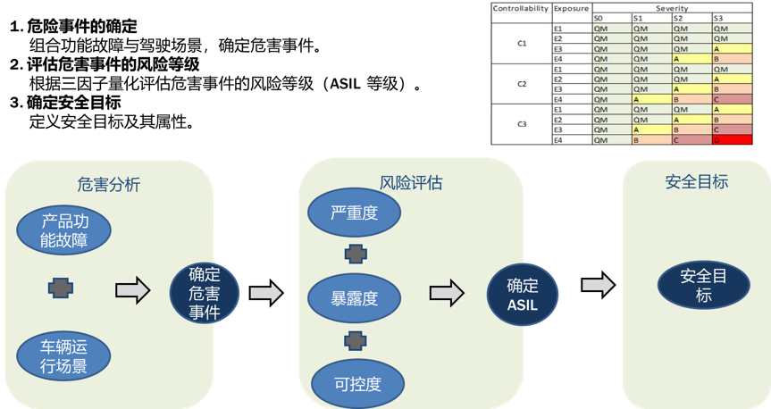

1. 项目信息——表1
2. 项目边界——表2
3. 正常功能+功能异常现象——表3
4. 运行场景（为E暴露度分析做准备）——表4
5. SEC规则参考——表5
6. 危险事件与SEC评估——表6
7. 安全目标——表7
8. 追踪矩阵（理解成功能—功能异常—具体危害—危害事件—安全目标—ASIL，这些内容的一个联系的矩阵）——表8
9. 尚不能确认的问题（开放问题）——表9
10. HARA分析表变更记录——表10

### **FSC**

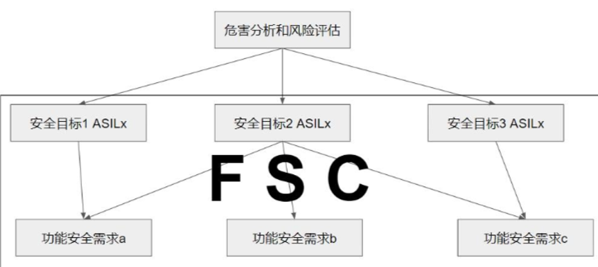

和HARA分析出来的SG（安全目标）挂钩

**FTTI 是什么概念**

FTTI 是 Fault Tolerant Time Interval 的缩写，中文译为 故障容错时间间隔。它是 ISO 26262 功能安全中一个极其关键的时间度量概念，定义了从故障发生到导致危害事件之间的最长时间窗口。

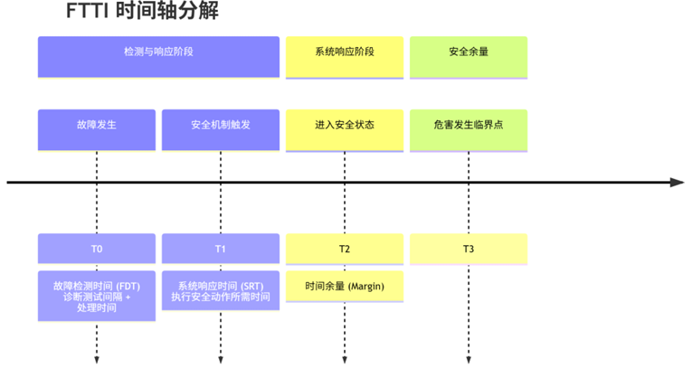

**计算公式：**

FTTI ≥ 故障检测时间 + 系统响应时间 + 时间余量

- 故障检测时间：从**故障发生到被安全机制识别**所需的时间（包含诊断测试周期）。
- 系统响应时间：从**触发安全机制到系统完全进入定义的安全状态**所需的时间。
- 时间余量：**考虑到时间抖动、不确定性而保留的缓冲**。

### FSR

FSR 是 Functional Safety Requirement 的缩写，中文译为 **功能安全需求**。它是由功能安全概念推导出的、具体、可验证、可分配的安全要求，是实现安全目标的直接手段。

核心特征：

1. 承上启下：FSR 是安全目标在功能层的细化，也是生成**技术安全需求（TSR）**的 **唯一输入**。
2. **技术无关：描述“系统应该做什么”来保证安全，而不规定“如何实现”。**例如：
   - 系统应检测到信号 A 的失效，而不说“通过使用比较器电路来检测”。
3. 可追溯：必须能清晰地**向上追溯**到所属的**功能安全概念**和**安全目标**，向下链接到实现它的技术安全需求和架构元素。
4. 可验证：必须能够通过**测试、分析或审查来验证其是否被正确实现**。通常使用**“应”、“必须”等强制性词语**，并包含**明确的条件、行为和标准**。

**标准FSR完整内容要素：**

| 要素         | 说明                       | 示例                                                         |
| ------------ | -------------------------- | ------------------------------------------------------------ |
| 唯一ID       | 需求标识符                 | FSR-1.1                                                      |
| 描述         | 需求的具体内容             | 系统应能通过比较冗余的驾驶员请求信号来检测非预期的制动扭矩请求。 |
| 安全状态     | 满足需求后系统应达到的状态 | 切断主建压通路，系统处于泄压状态。                           |
| FTTI         | 满足此需求的最大允许时间   | ≤20ms                                                        |
| 故障处理     | 检测到故障后采取的具体措施 | 关闭主进液阀，点亮红色制动故障警告灯，记录故障码DTC。        |
| 关联安全目标 | 向上追溯                   | SG-1 (ASIL D)                                                |
| 验证方法     | 如何证明需求被满足         | 故障注入测试、模型在环测试                                   |
| 分配         | 初步分配到哪个功能模块     | 制动控制单元（主逻辑）                                       |

### TSC

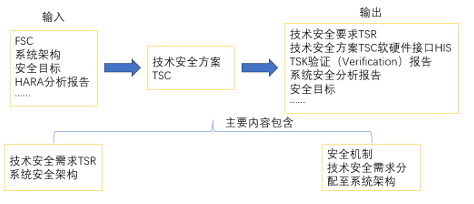

TSC 是 **技术安全概念（Technical Safety Concept）** 的缩写。

在ISO 26262功能安全标准中，TSC是一个位于**系统开发阶段**的核心工作产物。如果说你之前了解的FSR（功能安全需求）定义了系统“**做什么**”来保证安全，那么TSC就是回答“**如何做**”的顶层技术方案。

TSC = 安全目标 + 故障假设 + 安全状态 + 时间约束

**第一步：收集输入（必须有的材料）**

在开始制作 TSC 前，你需要：

| 输入文档            | 内容                                         | 用途           |
| ------------------- | -------------------------------------------- | -------------- |
| 安全目标清单        | SG-1: 防止非预期制动<br>SG-2: 确保基础制动力 | TSC 的“出发点” |
| 功能安全需求（FSR） | 具体的检测、处理、响应要求                   | TSC 的“素材库” |
| 系统架构草图        | 主模块组成和连接关系                         | 确定技术可行性 |
| 危害分析结果        | 各种故障场景的危害程度                       | 确定 FTTI 时间 |

**第二步：分解安全目标（按故障类型分组）**

技巧：不要按 FSR 逐条翻译，而是按故障影响分组。

以 SG-1（防止非预期制动）为例：

可能原因：

1. 传感器错误 → 给出假信号  
2. 控制器发疯 → 乱发指令  
3. 执行器乱动 → 阀门自己开  

对应分组：

- **TSC-1**: 输入信号可信性保障  
- **TSC-2**: 控制逻辑正确性保障  
- **TSC-3**: 执行器行为可控性保障  

分组原则：一个 TSC 覆盖一类故障源的完整应对策略。

**第四步：组合标准格式**

**标准 TSC 条目模板：**

**TSC-[编号]：[针对什么故障]**

- **故障条件：[什么情况下触发]**

- **安全状态：[必须达到什么状态]**

- **FTTI：[必须在多长时间内完成]**

- **备注：（可选）特殊约束或假设**

### TSR

FSR 是功能层面的“做什么”，而技术安全需求是系统/硬件/软件层面的“如何做”。TSR 由 FSR 导出，但包含具体的技术参数。

示例演变：

- **FSR**: FSR-1.1：系统应能通过比较冗余信号检测非物理性偏差。（做什么）

- **导出的 TSR (硬件)**: TSR-HW-1.1.1：两个踏板位置传感器应由独立的 5V 参考电源供电，采样电路应彼此隔离，ADC 采样频率不低于 1kHz。

- **导出的 TSR (软件)**: TSR-SW-1.1.1：软件应在每个 10ms 的任务周期内，计算两个传感器信号差值的绝对值，若差值超过阈值 X 且持续超过 3 个周期，则触发故障处理程序。

  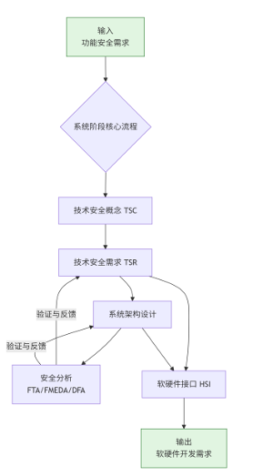

**示例：**

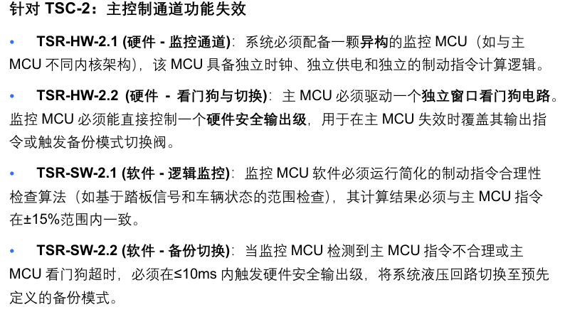

这里用的SW/HW也可以，如下表：

| **硬件安全需求**       | HSR  | 分配给硬件部分的技术安全需求。                           | **硬件如何做**？ |
| ---------------------- | ---- | -------------------------------------------------------- | ---------------- |
| **软件安全需求 (SSR)** | SSR  | **分配给软件部分的技术安全需求在软件层面的进一步细化**。 | **软件如何做**？ |


## 系统定义

这个单踏板控制项目究竟负责什么、不负责什么、和谁交互、在什么条件下工作，以及外部系统必须满足哪些假设。

内容包括：

- 单踏板系统目的
- P/R/N/D/B 模式
- 系统边界
- 驾驶员责任
- 液压制动系统责任
- 电机 ECU 责任
- CAN 接口
- 安全相关假设
- 正常和异常运行状态
- 不在项目范围内的功能

| 对象               | 是否属于 Item | 说明                                  |
| ------------------ | ------------: | ------------------------------------- |
| 单踏板控制算法     |            是 | 核心功能                              |
| 挡位状态机         |            是 | 决定 P/R/N/D/B 行为                   |
| 踏板信号合理性检查 |            是 | 控制器安全机制                        |
| CAN 信号有效性检查 |            是 | 控制器安全机制                        |
| 扭矩请求计算与限幅 |            是 | 核心输出                              |
| 故障状态和降级模式 |            是 | 功能安全行为                          |
| 踏板传感器硬件     |            否 | 外部传感器，只定义接口和假设          |
| 电机及电机 ECU     |            否 | 执行扭矩请求的外部系统                |
| 液压制动系统       |            否 | 独立安全后备系统                      |
| 变速器机械机构     |            否 | 外部执行系统                          |
| 仪表和蜂鸣器       |            否 | 执行告警的外部系统                    |
| Vehicle Plant      |            否 | 仅用于仿真的验证环境，不属于产品 Item |

## 控制模型

顺序：

| 顺序 | 文件                  | 内容                         | 验收标准                 |
| ---- | --------------------- | ---------------------------- | ------------------------ |
| 1    | `TransmissionState.m` | 定义 P/R/N/D/Brake 枚举      | MATLAB 能正确识别枚举    |
| 2    | `init_fn.m`           | 车辆、扭矩、速度、阻力参数   | 工作区变量完整生成       |
| 3    | `plant.slx`           | 车辆纵向动力学模型           | 输入扭矩后车速响应正常   |
| 4    | `controller.slx`      | 挡位状态机与扭矩计算         | 各挡位切换和扭矩输出正确 |
| 5    | `harness.slx`         | 连接驾驶员、控制器和车辆模型 | 可以完成闭环仿真         |
| 6    | 正常功能验证          | P/R/N/D/Brake 场景           | 波形与原工程基本一致     |

顺序：

```
接口和参数
    ↓
TransmissionState + init_fn
    ↓
Plant 开环模型
    ↓
Controller 状态机
    ↓
Harness 闭环集成
    ↓
场景仿真与结果检查
```

不要一开始就搭 `harness.slx`。Plant 和 Controller 必须先分别编译通过。

### Plant模型

**1. Plant物理方程**

该模型使用简化纵向动力学：

**公式部分：**
\[
T_{wheel} = T_{request} \cdot i_t
\]

\[
F_{drive} = \frac{T_{wheel}}{r}
\]

\[
F_{air} = X_{air} \cdot v^2
\]

\[
F_{tyre} = X_{tyres} \cdot |v|
\]

\[
F_{slope} = m g \sin(\theta)
\]

\[
a = \frac{F_{drive} + F_{slope} - \text{sign}(v)(F_{air} + F_{tyre})}{m}
\]

\[
v = \int a \, dt
\]

**说明：**

其中内部速度使用 m/s，**输出转换为 km/h。**

| 符号                       | 名称             | 单位        | 含义                                                         |
| -------------------------- | ---------------- | ----------- | ------------------------------------------------------------ |
| \(T_{request}\)            | 电机扭矩请求     | N·m         | **Controller向电机或Plant请求的扭矩**；正值驱动车辆前进，负值用于再生制动或倒车 |
| \(T_{wheel}\)              | 车轮侧驱动扭矩   | N·m         | 经过**传动系统放大后作用在驱动轮上的总扭矩**                 |
| \(i_t\)                    | 总传动比         | —           | 电机轴到驱动轮之间的总减速比；项目中**对应 `TRANSMISSION_RATIO=12`** |
| \(r\)                      | 车轮半径         | m           | 驱动轮的等效滚动半径；项目中为 \(0.30\text{ m}\)             |
| \(F_{drive}\)              | 驱动力           | N           | 车轮扭矩在轮胎与路面接触位置产生的纵向驱动力                 |
| \(F_{air}\)                | 空气阻力         | N           | 车辆运动时受到的空气阻力，其大小与车速平方成正比             |
| \(X_{air}\)                | 空气阻力系数     | N·s²/m²     | 将车速平方换算为空气阻力的综合系数，项目中由 \(\frac{1}{2}S\rho c_x\) 计算 |
| \(S\)                      | 车辆迎风面积     | m²          | 车辆正面迎风面积；项目中为 \(3.5\text{ m}^2\)                |
| \(\rho\)                   | 空气密度         | kg/m³       | 环境空气密度；项目中为 \(1.25\text{ kg/m}^3\)                |
| \(c_x\)                    | 空气阻力系数     | —           | 与车身外形和空气动力学特性有关的无量纲系数；项目中为 0.3     |
| \(F_{tyre}\)               | 轮胎滚动阻力     | N           | 轮胎与路面相互作用产生的纵向阻力，简化为与车速绝对值成正比   |
| \(X_{tyres}\)              | 轮胎滚阻系数     | N·s/m       | 将车速绝对值换算为轮胎滚动阻力的综合系数                     |
| \(F_{slope}\)              | 坡度方向重力分量 | N           | 车辆重力沿道路纵向的分量；其正负取决于坡度角和坐标方向约定   |
| \(m\)                      | 车辆质量         | kg          | 车辆的等效总质量；项目中为 \(1600\text{ kg}\)                |
| \(g\)                      | 重力加速度       | m/s²        | 地球表面的重力加速度，通常取 \(9.81\text{ m/s}^2\)           |
| \(\theta\)                 | 道路坡度角       | rad 或 °    | 道路相对于水平面的倾斜角；代入 \(\sin\) 前必须转换为弧度     |
| \(F_{drag}\)               | 总行驶阻力       | N           | 空气阻力与轮胎滚动阻力之和，即 \(F_{air}+F_{tyre}\)          |
| \(F_{resist}\)             | 带方向的总阻力   | N           | 通过车速符号确定方向后的阻力，始终与车辆运动方向相反         |
| \(a\)                      | 车辆纵向加速度   | m/s²        | 车辆沿纵向方向的速度变化率，等于纵向合力除以车辆质量         |
| \(v\)                      | 车辆纵向速度     | m/s         | Plant内部使用的车辆速度；输出前乘以 3.6 转换为 km/h          |
| \(v_0\)                    | 初始车速         | km/h 或 m/s | 仿真开始时的车辆速度；进入积分器前应统一换算为 m/s           |
| \(\operatorname{sign}(v)\) | 车速符号函数     | —           | 当 \(v>0\) 时为 1，\(v<0\) 时为 −1，用来**确保行驶阻力与运动方向相反** |
| \(\int a\,dt\)             | 加速度积分       | m/s         | 对纵向加速度随时间积分，得到车辆纵向速度                     |
| \(t\)                      | 时间             | s           | 仿真时间或动力学积分的自变量                                 |

输入与输出：

| 类别 | 信号                 | 数据类型 | 单位 | 含义                                                         |
| ---- | -------------------- | -------- | ---- | ------------------------------------------------------------ |
| 输入 | `TorqueRequest_Nm`   | `single` | N·m  | Controller发出的电机侧扭矩请求；**正值用于前进驱动，负值用于再生制动或倒车** |
| 输出 | `Vehicle_Speed_km_h` | `single` | km/h | Plant根据扭矩、阻力、坡度和车辆质量计算出的**纵向车速**      |

本质逻辑就是根据上面公式把模型搭建出来。

关于坡度力：模型使用 Pulse Generator 产生坡度角：

```
Pulse Generator
 → Gain(pi/180)
 → Sin
 → Gain(m*9.81)
 → Add 的正输入
```

参数：

| 参数        | 原模型值   |
| ----------- | ---------- |
| Pulse type  | Time based |
| Amplitude   | 0          |
| Period      | 2          |
| Pulse width | 50         |
| Phase delay | 5          |
| Sample time | 1          |

由于幅值为 0，当前实际相当于平路。复现时仍可保留该支路，后续把幅值改成道路坡度角进行测试。


关于积分器：

积分器满足：

\[ \frac{dv}{dt}=a \]

因此：

\[ v(t)=v(0)+\int_0^t a(\tau)\,d\tau \]

也就是说：

- 积分器输入：纵向加速度，单位为 \(\mathrm{m/s^2}\)
- 积分器状态：车辆速度，单位为 \(\mathrm{m/s}\)
- 积分器输出：车辆速度，单位为 \(\mathrm{m/s}\)

该模型中的 Integrator开启了外部初值和饱和状态端口，所以不是最普通的单输入单输出积分器。

```
                    ┌──────────────────┐
加速度 a ──────────→│                  │────→ 车速 v（m/s）
初始车速 v0 ───────→│    Integrator    │
                    │                  │────→ 饱和状态
                    └──────────────────┘
```

```
v0_km_h
   ↓
Gain：1/3.6
   ↓
Integrator 初值端口
```

因为参数 `v0` 使用 km/h，而积分器内部状态使用 m/s，所以必须换算：

\[ v_0[\mathrm{m/s}] = \frac{v_0[\mathrm{km/h}]}{3.6} \]

例如初始车速为 72 km/h：

\[ v_0=\frac{72}{3.6}=20\,\mathrm{m/s} \]

积分器输出从 20 m/s 开始，而不是从零开始。

模型的 `v0_km_h` Constant实际写成了 `0`。如果希望使用初始化脚本中的参数，建议将其值设置为：

```
v0
```


原模型启用了：

```
Show saturation port = On
```

积分器会额外输出饱和状态信号：

| 输出值 | 含义               |
| ------ | ------------------ |
| 0      | 速度没有达到上下限 |
| 1      | 速度达到上限       |
| −1     | 速度达到下限       |

该端口连接到：

```
Stop Simulation
```

因此，当车速达到最大前进或倒车速度限制时，仿真停止。（非0即可）Simulink 的 `Stop Simulation` 只有一个核心逻辑：

\[ \boxed{u\neq0\quad\Rightarrow\quad停止仿真} \]

输入为 `0` 时继续运行；输入为任何非零值时，Simulink 会完成当前仿真时间步，然后终止仿真。


启用了：

```
Limit output = On
```

上限为：

```
MAX_SPEED_FORWARD/3.6
```

下限为：

```
-MAX_SPEED_BACKWARD/3.6
```

代入项目参数：

\[ v_{\max}=\frac{240}{3.6}=66.67\,\mathrm{m/s} \]\[ v_{\min}=-\frac{60}{3.6}=-16.67\,\mathrm{m/s} \]

因此积分器状态范围是：

\[ -16.67\le v\le66.67\quad\mathrm{m/s} \]

对应输出车速：

\[ -60\le v_{\mathrm{km/h}}\le240 \]

负速度表示车辆倒车。


电机通过减速器连接车轮，因此电机转速高于车轮转速：

\[ \boxed{\omega_{motor}=i_t\omega_{wheel} =\frac{i_t v}{r}} \]

转换成 rpm

角速度单位 rad/s 通常不方便观察，因此会转换为 rpm：

\[ n_{motor} = \omega_{motor}\frac{60}{2\pi} \]

代入上式：

\[ \boxed{ n_{motor} = \frac{60}{2\pi r}i_t v } \]


关于功率计算：支路仅用于观察，不影响车辆运动：

```
F_drive × v
 → Abs
 → 与 sign(TorqueRequest_Nm) 相乘
 → Power_W Display
```

Scope、Display 可以最后添加，它们不是核心算法。


Model Settings：

```
Solver type : Variable-step
Solver      : VariableStepAuto
Stop time   : 10
```

### Controller模型

| 方向 | 端口号 | 信号名称                            | 数据类型            | 单位/范围         | 说明                                   |
| ---- | ------ | ----------------------------------- | ------------------- | ----------------- | -------------------------------------- |
| 输入 | 1      | `BrakePedalPressed`                 | `boolean`           | `0/1`             | 制动踏板是否踩下                       |
| 输入 | 2      | `ThrottlePedalPosition`             | `single`            | `[0,1]`           | 归一化加速踏板位置                     |
| 输入 | 3      | `AutomaticTrasmissionSelectorState` | `TransmissionState` | P/R/N/D/B         | 驾驶员请求挡位                         |
| 输入 | 4      | `VehicleSpeed_km_h`                 | `single`            | km/h              | 当前车辆速度                           |
| 输出 | 1      | `TorqueRequest_Nm`                  | `single`            | Nm，约 `[-80,80]` | 电机扭矩请求，正值驱动、负值制动或倒车 |
| 输出 | 2      | `AutomaticTransmissionState`        | `TransmissionState` | P/R/N/D/B         | 控制器确认后的实际挡位                 |

对挡位要有枚举：

> > TransmissionState
> > 错误使用 TransmissionState
> > 输入与枚举类 'TransmissionState' 的成员不对应。

这是正常现象。`TransmissionState` 是枚举类，不能像函数一样单独执行。

五个状态含义：

| 顶层状态  | 挡位 | 中文含义   | 主要作用                                                     | 扭矩请求                                                     |
| --------- | ---- | ---------- | ------------------------------------------------------------ | ------------------------------------------------------------ |
| `Park`    | P    | 驻车       | 车辆启动后的默认状态；**离开 P 挡前需要踩下制动踏板**        | 始终为 `0 Nm`                                                |
| `Neutral` | N    | 空挡       | 不提供驱动或制动扭矩，同时作为 P、R、D/B 之间的**安全换挡过渡状态** | 始终为 `0 Nm`                                                |
| `Drive`   | D    | 普通前进   | **根据加速踏板位置请求正向驱动扭矩**；踩下制动踏板时切断扭矩 | 松开制动：`80 × 踏板位置`；踩下制动：`0 Nm`  松开制动踏板后，电机扭矩由加速踏板决定； 踩下制动踏板后，无论加速踏板位置是多少，扭矩都置为 0。 |
| `Reverse` | R    | 倒车       | **根据加速踏板位置请求负向扭矩，使车辆倒车**；踩下制动踏板时切断扭矩 | 松开制动：`−40 × 踏板位置`；踩下制动：`0 Nm` 松开制动踏板后，电机扭矩由加速踏板决定； 踩下制动踏板后，无论加速踏板位置是多少，扭矩都置为 0。 |
| `Brake`   | B    | 单踏板模式 | 将踏板行程分为**再生制动区和加速区**；**松踏板制动，深踩踏板加速** | 踏板 `0～1/3`：约 `−80～0 Nm`；踏板 `1/3～1`：约 `0～80 Nm`  |

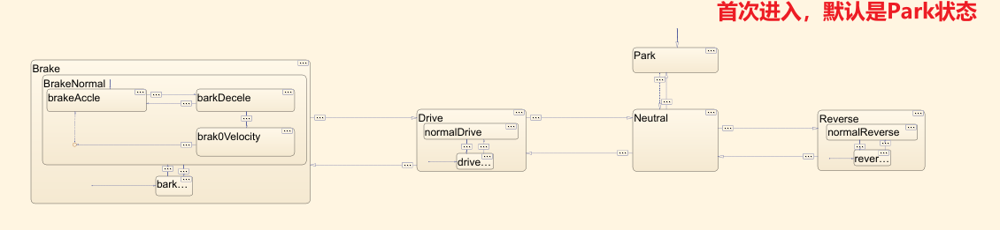

看不同状态内部：

状态动作：

```
Park
entry:
    AutomaticTransmissionState = TransmissionState.Park;
during:
    TorqueRequest_Nm = 0;
    
Neutral
entry:
    AutomaticTransmissionState = TransmissionState.Neutral;
during:
    TorqueRequest_Nm = 0;
    
Drive
entry:
    AutomaticTransmissionState = TransmissionState.Drive;
    
Reverse
entry:
    AutomaticTransmissionState = TransmissionState.Reverse;
    
Brake
entry:
    AutomaticTransmissionState = TransmissionState.Brake;
```

| Stateflow 状态 | 状态进入时 `entry/en` 做什么               | 状态激活期间 `during/du` 做什么                              | 作用                               |
| -------------- | ------------------------------------------ | ------------------------------------------------------------ | ---------------------------------- |
| `Park`         | 将实际挡位设为 `TransmissionState.Park`    | 持续将扭矩请求设为 `0 Nm`                                    | 保持驻车，不允许电机输出扭矩       |
| `Neutral`      | 将实际挡位设为 `TransmissionState.Neutral` | 持续将扭矩请求设为 `0 Nm`                                    | 保持空挡，同时作为换挡**过渡**状态 |
| `Drive`        | 将实际挡位设为 `TransmissionState.Drive`   | 进入子状态，顶层状态不直接计算扭矩，由内部的 `driveStop` 和 `normalDrive` 计算 | 管理普通前进模式                   |
| `Reverse`      | 将实际挡位设为 `TransmissionState.Reverse` | **进入子状态，**顶层状态不直接计算扭矩，由内部的 `reverseStop` 和 `normalReverse` 计算 | 管理倒车模式                       |
| `Brake`        | 将实际挡位设为 `TransmissionState.Brake`   | **进入子状态，**顶层状态不直接计算扭矩，由内部的停车、再生制动和加速子状态计算 | 管理 B 挡单踏板模式                |

**状态切换：**

**Park → Neutral**

```
[BrakePedalPressed == 1 && ...
 AutomaticTrasmissionSelectorState ~= TransmissionState.Park]
```

设计含义：离开 P 挡前必须踩住制动踏板，**先进入 N 挡作为中间状态。**

BrakePedalPressed == 1代表制动踏板踩了

AutomaticTransmissionSelectorState是外面驾驶员输入的状态，要是N你才能该

**Neutral → Park**

```
[VehicleSpeed_km_h < 5 && ...
 VehicleSpeed_km_h > -5 && ...
 BrakePedalPressed == 1 && ...
 AutomaticTrasmissionSelectorState == TransmissionState.Park]
```

车速在-5到5之间，且踩了制动踏板，驾驶员输入是p


**Neutral → Reverse**

```
[VehicleSpeed_km_h < 5 && ...
 BrakePedalPressed == 1 && ...
 AutomaticTrasmissionSelectorState == TransmissionState.Reverse]
```

如果要完全符合需求，建议增加：

```
VehicleSpeed_km_h > -5
```

车速在-5到5之间，且踩了制动踏板，驾驶员输入是R


**Neutral → Drive**

```
[VehicleSpeed_km_h > -5 && ...
 BrakePedalPressed == 1 && ...
 (AutomaticTrasmissionSelectorState == TransmissionState.Drive || ...
  AutomaticTrasmissionSelectorState == TransmissionState.Brake)]
```


**Reverse → Neutral**

```
[AutomaticTrasmissionSelectorState ~= TransmissionState.Reverse]
```


**Drive → Neutral**

```
[AutomaticTrasmissionSelectorState == TransmissionState.Neutral]
```


**Drive → Brake**

原模型为：

```
[ThrottlePedalPosition > 1/3 && ...
 AutomaticTrasmissionSelectorState == TransmissionState.Brake]
```

驾驶员选择 B 挡后，还必须把踏板踩到加速区，状态机才真正进入 B 挡。

进入 B 挡后，再根据踏板位置选择内部状态：

| 踏板位置  | B 挡内部状态    | 行为     |
| --------- | --------------- | -------- |
| `p ≤ 1/3` | `barkDecele`    | 再生制动 |
| `p > 1/3` | `brakeAccle`    | 正向加速 |
| 接近零速  | `brak0Velocity` | 零速保持 |

这里存在设计问题：驾驶员在踏板小于等于 `1/3` 时选择 B 挡，状态可能无法进入 Brake。规范实现，应改为只判断挡位请求：

```
[AutomaticTrasmissionSelectorState == TransmissionState.Brake]
```

更清晰的顶层转换应该是：

```
Drive → Brake
[AutomaticTrasmissionSelectorState == TransmissionState.Brake]
```

然后由 B 挡内部判断：

```
[ThrottlePedalPosition <= 1/3] → barkDecele
[ThrottlePedalPosition > 1/3]  → brakeAccle
```


**Brake → Drive**

原模型为：

```
[AutomaticTrasmissionSelectorState == TransmissionState.Drive || ...
 AutomaticTrasmissionSelectorState == TransmissionState.Neutral]
```

**规范实现时，B→N 应直接进入 Neutral，而不是先进入 Drive。**B到N有一条，N到B有一条


**子状态：**

**Drive子状态**

在 Drive 中创建：

```
driveStop
normalDrive
```

| 子状态        | 进入条件                   | 状态动作                                        | 实际含义                 |
| ------------- | -------------------------- | ----------------------------------------------- | ------------------------ |
| `driveStop`   | 默认进入；或者踩下制动踏板 | `TorqueRequest_Nm = 0`                          | 切断电机驱动扭矩         |
| `normalDrive` | 制动踏板未踩下             | `TorqueRequest_Nm = 80 × ThrottlePedalPosition` | 根据加速踏板请求正向扭矩 |

默认状态：

```
Default → driveStop
```

动作：

```
driveStop
during:
    TorqueRequest_Nm = 0;
normalDrive
during:
    TorqueRequest_Nm = single(ThrottlePedalPosition) * 960/12;
```

因为：

```
960/12 = 80 Nm
```

| 加速踏板位置 | 扭矩请求 |
| ------------ | -------- |
| 0            | 0 Nm     |
| 0.25         | 20 Nm    |
| 0.5          | 40 Nm    |
| 0.75         | 60 Nm    |
| 1            | 80 Nm    |

转换：

```
driveStop → normalDrive
[BrakePedalPressed ~= 1]
normalDrive → driveStop
[BrakePedalPressed == 1]
```

**Reverse子状态**

创建：

```
reverseStop
normalReverse
```

默认进入 `reverseStop`。

| 子状态          | 激活条件                             | 状态动作                                         | 含义                     |
| --------------- | ------------------------------------ | ------------------------------------------------ | ------------------------ |
| `reverseStop`   | 默认进入 Reverse；或者制动踏板被踩下 | `TorqueRequest_Nm = 0`                           | 切断电机倒车扭矩         |
| `normalReverse` | 制动踏板未踩下                       | `TorqueRequest_Nm = -40 × ThrottlePedalPosition` | 根据加速踏板请求倒车扭矩 |

动作：

```
reverseStop
during:
    TorqueRequest_Nm = 0;
normalReverse
during:
    TorqueRequest_Nm = ...
        -8 * single(ThrottlePedalPosition) * 60/12;
```

该公式等价于：

```
TorqueRequest_Nm = -40 × ThrottlePedalPosition
```

| 加速踏板位置 | 扭矩请求 | 行为         |
| ------------ | -------- | ------------ |
| 0            | 0 Nm     | 不主动倒车   |
| 0.25         | −10 Nm   | 小扭矩倒车   |
| 0.5          | −20 Nm   | 中等扭矩倒车 |
| 0.75         | −30 Nm   | 较大扭矩倒车 |
| 1            | −40 Nm   | 最大倒车扭矩 |

转换条件仍由制动踏板控制。

**Brake子状态**

Brake 中首先创建：

```
Brake
├── barkStop
└── BrakeNormal
    ├── brakeAccle
    ├── barkDecele
    └── brak0Velocity
```

原模型拼写是 `barkStop`，正常命名应为 `brakeStop`。

B 挡使用同一个加速踏板完成两种功能：

```
踏板松开                         踏板踩下
p = 0            p = 1/3          p = 1
  ├────再生制动────┤─────加速──────┤
 -80 Nm           0 Nm           80 Nm
```

| 子状态        | 激活条件                               | 动作                                       | 含义           |
| ------------- | -------------------------------------- | ------------------------------------------ | -------------- |
| `barkStop`    | 默认进入 Brake；或者**制动踏板被踩下** | `TorqueRequest_Nm = 0`                     | 切断电机扭矩   |
| `BrakeNormal` | **制动踏板未踩下**                     | 根据踏板和车速选择加速、再生制动或零速保持 | 正常单踏板控制 |

默认进入停止状态：

```
Default → barkStop
barkStop
entry:
    TorqueRequest_Nm = 0;
```

转换：

```
barkStop → BrakeNormal
[BrakePedalPressed ~= 1]
BrakeNormal → barkStop
[BrakePedalPressed == 1]
```

**BrakeNormal内部状态**

**1. brakeAccle：B挡加速区**

当踏板位置大于 `1/3` 时进入加速区。

原模型动作：

```
TorqueRequest_Nm = ...
    single(ThrottlePedalPosition - 1/3) ...
    * 1.5 * 960/12;
```


```
p = ThrottlePedalPosition
```

| 踏板位置 | 扭矩请求 |
| -------- | -------- |
| `1/3`    | 0 Nm     |
| `0.5`    | 20 Nm    |
| `2/3`    | 40 Nm    |
| `1`      | 80 Nm    |

其作用是把踏板的后 `2/3` 行程重新映射到 `0～80 Nm`。

转换到再生制动区：

```
brakeAccle → barkDecele
[ThrottlePedalPosition <= 1/3]
```

**2. barkDecele：再生制动区**

当踏板位置不超过 `1/3` 时，输出负扭矩。

原模型动作：

```
TorqueRequest_Nm = ...
    -3 * single(1/3 - ThrottlePedalPosition) ...
    * 960/12;
```

化简后：

\[ T=-240\left(\frac{1}{3}-p\right) \]

也可以写成：

\[ T=240\left(p-\frac{1}{3}\right) \]

| 踏板位置 | 扭矩请求 | 行为         |
| -------- | -------- | ------------ |
| 0        | −80 Nm   | 最大再生制动 |
| 1/12     | −60 Nm   | 较强再生制动 |
| 1/6      | −40 Nm   | 中等再生制动 |
| 1/4      | −20 Nm   | 较弱再生制动 |
| 1/3      | 0 Nm     | 中性点       |

踏板越松，负扭矩越大。

返回加速区：

```
barkDecele → brakeAccle
[ThrottlePedalPosition > 1/3]
```

**3. brak0Velocity：零速保持**

车辆通过再生制动减速到接近静止时：

```
barkDecele → brak0Velocity
[VehicleSpeed_km_h <= 0.2]
```

进入零速保持状态。

原模型执行：

```
error = 0 - VehicleSpeed_km_h;
sumError = sumError + error;
TorqueRequest_Nm = error*30 + sumError*2;
```

这是一个简单 PI 控制器：

\[ e=0-v \]

\[ \sum e=\sum e+e \]

\[ T=30e+2\sum e \]

其目标是：

```
目标车速 = 0 km/h
```

| 车辆状态           | 误差   | PI扭矩方向             |
| ------------------ | ------ | ---------------------- |
| 车辆仍向前缓慢运动 | 负误差 | 请求负扭矩，使车辆减速 |
| 车辆静止           | 0      | 理论上保持当前平衡     |
| 车辆开始向后溜     | 正误差 | 请求正扭矩，阻止倒溜   |

**离开零速状态：**

```
[ThrottlePedalPosition > 1/3]
```

**表示驾驶员将踏板踩入加速区后，退出零速保持并进入 `brakeAccle`。**

退出时：

```
exit:
    sumError = 0;
```

清除积分累计值，防止下一次进入零速控制时继承旧积分。

### Harness模型

`Rate Transition` 用来在不同采样时间或不同执行任务之间安全地传递信号。

这个项目中：

| 模型             | 类型         | 采样特性          |
| ---------------- | ------------ | ----------------- |
| `controller.slx` | 离散控制器   | 固定步长 `0.01 s` |
| `plant.slx`      | 连续车辆模型 | 变步长连续求解    |
| `harness.slx`    | 闭环仿真模型 | `ode45` 变步长    |

因此Controller每隔 `0.01 s` 计算一次，而Plant在两个控制周期之间还会进行多次连续积分。

```
Controller：0      0.01      0.02      0.03
            ●────────●─────────●─────────●

Plant：     ●─●──●─●────●──●─●────●──●──●
            变步长连续计算
```

`Rate Transition`负责协调这两种不同的更新节奏。——就是按照输出的对象的采样周期给出数据

| 模块               | 信号方向           | 作用                                               |
| ------------------ | ------------------ | -------------------------------------------------- |
| `Rate Transition1` | Controller → Plant | 在下一个Controller计算周期到来前，保持当前扭矩请求 |
| `Rate Transition2` | Plant → Controller | 按Controller的采样周期获取当前车速                 |

Controller每 `0.01 s` 输出一次扭矩。

例如：

| 时间   | Controller输出扭矩 |
| ------ | ------------------ |
| 0.00 s | 0 Nm               |
| 0.01 s | 20 Nm              |
| 0.02 s | 40 Nm              |

Plant在 `0.01～0.02 s` 之间进行连续积分时，Rate Transition会保持 `20 Nm`：

```
0.00～0.01 s：保持 0 Nm
0.01～0.02 s：保持 20 Nm
0.02～0.03 s：保持 40 Nm
```

本质上相当于零阶保持。

### Driver子系统

`Driver` 子系统的作用不是实现车辆控制算法，而是模拟驾驶员操作：根据目标车速和实际车速自动生成加速踏板位置，同时按预设时序生成制动踏板和挡位选择信号。

| 类别  | 端口                                 | 类型                | 含义                          |
| ----- | ------------------------------------ | ------------------- | ----------------------------- |
| 输入  | `Vehicle_Speed_km_h`                 | 继承                | Plant反馈的实际车速           |
| 输出1 | `ThrottlePedalPosition`              | `single`            | 归一化加速踏板位置，范围 0～1 |
| 输出2 | `BrakePedalPressed`                  | `boolean`           | 制动踏板状态                  |
| 输出3 | `AutomaticTransmissionSelectorState` | `TransmissionState` | 驾驶员请求的挡位              |

子系统内部负责生成测试指令的子系统：：

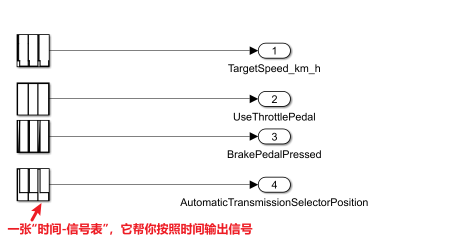

**功能测试：**

| 时间              | 目标车速   | 自动踏板 | 制动踏板                      | 请求挡位 | 主要行为                                                     | 测试目的                       |
| ----------------- | ---------- | -------- | ----------------------------- | -------- | ------------------------------------------------------------ | ------------------------------ |
| 0～约2 s          | 0 km/h     | 禁用     | 踩下                          | P        | 车辆保持驻车，扭矩为0                                        | 初始状态和P挡保持              |
| 约2～3 s          | 0 km/h     | 禁用     | 踩下                          | B        | 状态机尝试从P挡进入B挡相关路径，但制动踏板保持踩下           | 测试踩制动换挡                 |
| 3～3.9 s          | 0 km/h     | 禁用     | 松开                          | B        | 松开制动，但自动踏板尚未启用，踏板位置保持0                  | 完成换挡后的静止准备           |
| 3.9～4 s          | 0→90 km/h  | 0→1      | 松开                          | B        | 目标车速和自动踏板逐渐启用                                   | 避免目标车速和踏板瞬间跳变     |
| 4～约4.67 s       | 90 km/h    | 启用     | 松开                          | B        | Driver开始增加踏板；状态机可能暂时仍在Drive，直到踏板超过1/3 | 满足原模型的D→B进入条件        |
| 约4.67～29.9 s    | 90 km/h    | 启用     | 松开                          | B        | B挡加速区工作，车辆向90 km/h加速                             | 测试B挡正扭矩加速              |
| 29.9～30 s        | 90→60 km/h | 启用     | 松开                          | B        | Driver减小踏板请求                                           | 目标车速下降过渡               |
| 30～39.9 s        | 60 km/h    | 启用     | 松开                          | B        | 车辆跟踪60 km/h；若实际车速偏高，踏板继续减小并可能进入再生制动区 | 测试B挡减速和速度跟踪          |
| 39.9～40 s        | 60→0 km/h  | 启用     | 松开                          | B        | 目标车速逐渐降为0，自动踏板请求趋向0                         | 准备再生制动停车               |
| 40～49.9 s        | 0 km/h     | 启用     | 松开                          | B        | `sign(TargetSpeed)=0`，踏板逐渐松开；B挡产生负扭矩使车辆减速 | 测试松踏板再生制动             |
| 49.9～约64.95 s   | 0 km/h     | 启用     | 原始信号0→0.5，转换后仍为松开 | B        | 车辆继续再生减速并尝试进入零速保持                           | 测试停车和零速控制             |
| 约64.95～79.9 s   | 0 km/h     | 启用     | 踩下                          | B        | `round` 后制动信号变为1，电机扭矩被置零                      | 为后续换倒挡做准备             |
| 79.9～约79.917 s  | 0 km/h     | 启用     | 踩下                          | B        | 保持B挡和零扭矩                                              | 开始移动挡位选择器             |
| 约79.917～79.95 s | 0 km/h     | 启用     | 踩下                          | D        | 挡位插值经 `round` 后经过Drive                               | 模拟挡杆从B向R移动             |
| 约79.95～79.983 s | 0 km/h     | 启用     | 踩下                          | N        | 挡位经过Neutral                                              | 为进入Reverse提供安全中间状态  |
| 约79.983～82.9 s  | 0 km/h     | 启用     | 踩下                          | R        | 进入Reverse，但保持 `reverseStop`，扭矩为0                   | 测试踩制动进入R挡              |
| 82.9～83 s        | 0→−20 km/h | 启用     | 踩下                          | R        | Driver开始生成倒车踏板请求，但制动优先，实际扭矩仍为0        | 先给出倒车目标、继续保持制动   |
| 83～约87.05 s     | −20 km/h   | 启用     | 踩下                          | R        | Reverse保持 `reverseStop`，车辆不应输出倒车扭矩              | 验证制动踏板优先               |
| 约87.05 s以后     | −20 km/h   | 启用     | 松开                          | R        | `reverseStop → normalReverse`，Controller根据踏板请求负扭矩  | 测试倒车加速和−20 km/h目标跟踪 |

## 功能安全设计

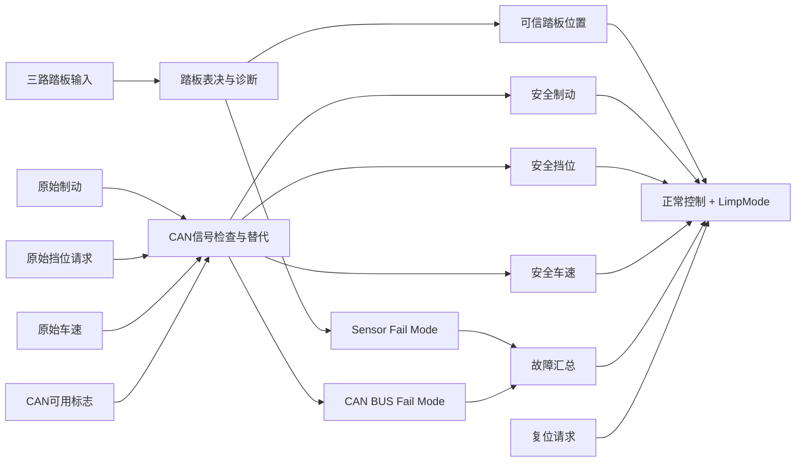

新增输入：

| 端口 | 名称                                | 类型                | 相对阶段2的变化                   |
| ---- | ----------------------------------- | ------------------- | --------------------------------- |
| 1    | `PedalPositionSensor`               | `single[3]`         | 单路踏板改成三路踏板              |
| 2    | `BrakePedalPressed`                 | `boolean`           | 保留，但作为未经检查的原始CAN信号 |
| 3    | `AutomaticTrasmissionSelectorState` | `TransmissionState` | 保留，但作为原始CAN信号           |
| 4    | `VehicleSpeed_km_h`                 | `single`            | 保留，但作为原始CAN信号           |
| 5    | `CAN BUS available Signals`         | `boolean[3]`        | 新增                              |
| 6    | `ThrottlePedalSensorReset`          | `boolean`           | 新增                              |

输出接口：

| 端口 | 名称                         | 类型                | 说明           |
| ---- | ---------------------------- | ------------------- | -------------- |
| 1    | `TorqueRequest_Nm`           | `single`            | 原有           |
| 2    | `AutomaticTransmissionState` | `TransmissionState` | 原有           |
| 3    | `Sensor Fail Mode`           | `int8`              | 新增踏板故障码 |
| 4    | `CAN BUS Fail Mode`          | `int8`              | 新增CAN故障码  |

==对应 `SSR-OPC-034`。==

### 三路踏板表决器

三路踏板表决器的核心逻辑是：

> 正常时取三路平均值；**识别出单路故障后隔离该路**，使用剩余两路平均值；**剩余两路也不可信时输出0，并锁存故障**。

输入为：

```
a、b、c：三路踏板位置，范围均为0～1
```

输出为：

```
out：可信踏板位置
SensorFailMode：故障码
```

故障码：

| 故障码 | 含义                 |
| ------ | -------------------- |
| 0      | 三路正常             |
| 1      | A路故障              |
| 2      | B路故障              |
| 3      | C路故障              |
| 4      | 无法形成两路可信输入 |

三路踏板信号组成的向量：

```
PedalPositionSensor[3]
```

通过 `Demux` 分成：

```
a
b
c
```

连接到此Stateflow。

整体结构：

```
PedalPositionSensor[3]
          │
        Demux
       ┌──┼──┐
       a  b  c
       │  │  │
    PedalVoter
       │     │
      out   SensorFailMode
```

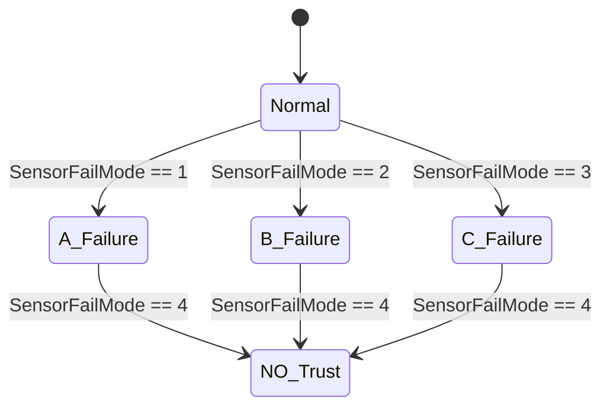

当前项目的设计是故障锁存：

- `A_Failure/B_Failure/C_Failure`不自动回到`Normal`；
- `NO_Trust`不自动退出；
- 恢复需要受控复位或重新上电。

在 `Normal` 状态的 `during` 动作中，首先计算通道差值：

```
abDiff = single(abs(a - b));
acDiff = single(abs(a - c));
bcDiff = single(abs(b - c));
```

然后按照A、B、C的顺序进行故障判断。

**A通道故障（其他几个通道同理）**

如果A超出有效范围：a只能在0和1之间

```
a < 0 或 a > 1
```

或者A同时与B、C不一致：允许有左右0.001的误差

```
|a-b| > 0.001 且 |a-c| > 0.001
```

则认为A故障：

```
out = single((b + c) / 2);
SensorFailMode = int8(1);
```

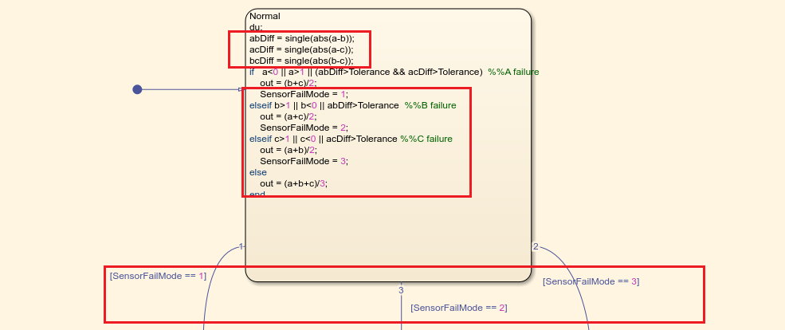

注意：ABC判断有顺序，先A，后B再C

如果都没问题直接：

```
out = single((a + b + c) / 3);
SensorFailMode = int8(0);
```

完整写法：

```
du:
    abDiff = single(abs(a-b));
    acDiff = single(abs(a-c));
    bcDiff = single(abs(b-c));

    if a < 0 || a > 1 || ...
       (abDiff > Tolerance && acDiff > Tolerance)

        out = single((b+c)/2);
        SensorFailMode = int8(1);

    elseif b < 0 || b > 1 || ...
           abDiff > Tolerance

        out = single((a+c)/2);
        SensorFailMode = int8(2);

    elseif c < 0 || c > 1 || ...
           acDiff > Tolerance

        out = single((a+b)/2);
        SensorFailMode = int8(3);

    else
        out = single((a+b+c)/3);
        SensorFailMode = int8(0);
    end
```

然后添加三条状态转换：

```
Normal → A_Failure  [SensorFailMode == 1]
Normal → B_Failure  [SensorFailMode == 2]
Normal → C_Failure  [SensorFailMode == 3]
```

**A_Failure状态逻辑（B，C同理）**

进入该状态表示A已经被隔离，只使用B和C。

进入动作：

```
en:
    SensorFailMode = int8(1);
    out = single((b+c)/2);
```

持续动作：

```
du:
    bcDiff = single(abs(b-c));

    if bcDiff > Tolerance || ...
       b < 0 || b > 1 || ...
       c < 0 || c > 1

        SensorFailMode = int8(4);
        out = single(0);
    else
        SensorFailMode = int8(1);
        out = single((b+c)/2);
    end
```

转换：

```
A_Failure → NO_Trust [SensorFailMode == 4]
```

**含义是：A已经坏了，如果剩余B、C又不一致，就无法继续判断哪一路正确。**

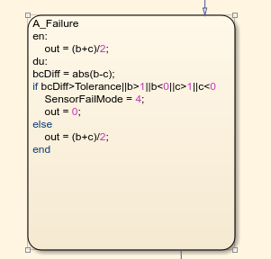

**NO_Trust状态**

该状态表示不能获得两路相互一致的可信踏板信号。

```
en:
    SensorFailMode = int8(4);
    out = single(0);

du:
    SensorFailMode = int8(4);
    out = single(0);
```

**需要在 `during` 中持续赋值，不能只在进入状态时赋值。**

**此状态不设置自动退出转换，即保持故障锁存。**


`out`替代原来直接输入状态机的踏板位置：

```
原来：
ThrottlePedalPosition → Main Control Chart

修改后：
三路踏板 → PedalVoter → out → Main Control Chart
```

`SensorFailMode`用于触发降级模式：

```
isFailMode = ...
    (SensorFailMode ~= 0) || ...
    (CAN_BUS_Fail_Mode ~= 0);
```

因此，只要识别出单路踏板故障，即使仍然可以使用剩余两路计算踏板位置，控制器也会进入**LimpMode：**（理解成有限制的输出）

```
单路故障
→ 隔离故障通道
→ 剩余两路平均
→ SensorFailMode = 1/2/3
→ Controller进入LimpMode
→ Drive最大扭矩从80 Nm降为8 Nm
```

### CAN Signal Checker

`CAN Signal Checker` 的作用不是解析CAN报文，而是：

> 根据外部提供的CAN信号可用标志，决定使用原始信号还是安全替代值，同时生成CAN组合故障码。

它检查三类安全相关输入：

- 制动踏板状态
- 挡位请求
- 车速

整体结构：

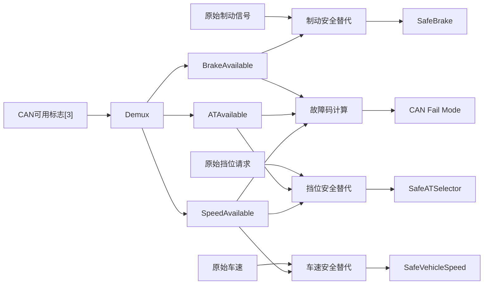

**输入端口**

| 端口 | 名称                  | 类型                | 含义                |
| ---- | --------------------- | ------------------- | ------------------- |
| 1    | `BrakePedalPressed`   | `boolean`           | 原始制动踏板状态    |
| 2    | `ATSelectorState`     | `TransmissionState` | 原始挡位请求        |
| 3    | `VehicleSpeed_km_h`   | `single`            | 原始车速            |
| 4    | `CANAvailableSignals` | `boolean[3]`        | 三个CAN信号可用标志 |

**输出端口**

| 端口 | 名称                    | 类型                | 含义                 |
| ---- | ----------------------- | ------------------- | -------------------- |
| 1    | `SafeBrakePedalPressed` | `boolean`           | 安全处理后的制动状态 |
| 2    | `SafeATSelectorState`   | `TransmissionState` | 安全处理后的挡位请求 |
| 3    | `SafeVehicleSpeed_km_h` | `single`            | 安全处理后的车速     |
| 4    | `CANFailMode`           | `int8`              | CAN组合故障码        |

输入向量定义为：

```
CANAvailableSignals =
[BrakeAvailable, ATSelectorAvailable, SpeedAvailable]
```

放置一个 `Demux`：

```
Number of outputs = 3
```

连接关系：

```
CANAvailableSignals
        │
      Demux
   ┌────┼────┐
   │    │    │
   1    2    3
   │    │    │
Brake  AT   Speed
Avail Avail Avail
```

顺序必须固定：和其他三个输入对应，作为是否输入可信的标志

| Demux输出 | 信号                  |
| --------- | --------------------- |
| 1         | `BrakeAvailable`      |
| 2         | `ATSelectorAvailable` |
| 3         | `SpeedAvailable`      |

 Available 理解成一个**经过通信诊断之后得到的“信号可信度布尔结果”**。来源于通信诊断后的结果

```text
CAN总线
  ↓
CAN Driver
  ↓
CAN Interface
  ↓
PduR / COM
  ↓
通信诊断 / E2E / Timeout监控
  ↓
┌────────────────────────────┐
│ BrakePedalPressed          │
│ BrakeAvailable             │
│                            │
│ ATSelectorState            │
│ ATSelectorAvailable        │
│                            │
│ VehicleSpeed               │
│ SpeedAvailable             │
└────────────────────────────┘
  ↓
CAN Signal Checker
  ↓
安全替代值 + CANFailMode
  ↓
应用层控制逻辑
```

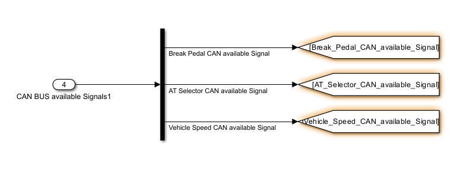

接着要基于CAN诊断的结果，选择具体使用什么信号：

要求是：

```
制动信号有效：使用真实制动状态
制动信号无效：按照制动已踩下处理
```

逻辑表达式：

```
if BrakeAvailable
    SafeBrakePedalPressed = BrakePedalPressed;
else
    SafeBrakePedalPressed = true;
end
```

制动信号丢失时，不能假设“驾驶员没有踩制动”，否则控制器可能继续输出驱动扭矩。

因此采用保守处理：

```
BrakeAvailable = false
→ SafeBrakePedalPressed = true
→ Drive/Reverse/Brake/Limp状态输出0 Nm
```

==对应：==

- ==`SSR-OPC-001`==
- ==`SSR-OPC-002`==
- ==`SSR-OPC-003`==

**挡位信号的安全替代**

阶段3模型的实际要求是：

> 只有挡位CAN和车速CAN都有效时，**才允许使用原始挡位请求。**

其实是你得保证你的车速和挡位都是有效信号，才能后续操作**（因为换挡和车速其实是息息相关）**

逻辑：

```
ATSignalUsable = ...
    ATSelectorAvailable && SpeedAvailable;
```

然后：

```
if ATSignalUsable
    SafeATSelectorState = ATSelectorState;
else
    SafeATSelectorState = TransmissionState.Neutral;
end
```

==对应 `SSR-OPC-031`。==

**CAN故障码计算**

三个CAN信号分别分配二进制权重：

| CAN信号 | 不可用时的权重 |
| ------- | -------------- |
| 制动CAN | 1              |
| 挡位CAN | 2              |
| 车速CAN | 4              |

计算公式：

```
CANFailMode = ...
    int8(~BrakeAvailable)      * int8(1) + ...
    int8(~ATSelectorAvailable) * int8(2) + ...
    int8(~SpeedAvailable)      * int8(4);
```

**第一步：取反**

因为你没问题是1，你去算故障码你不能把1算进去，那不是算成故障了么，按照常规逻辑需要取反。

放置三个 `Logical Operator`：

```
Operator = NOT
```

得到：

```
BrakeFault = NOT BrakeAvailable
ATFault    = NOT ATSelectorAvailable
SpeedFault = NOT SpeedAvailable
```

也就是：

```
可用标志=true  → 故障标志=false
可用标志=false → 故障标志=true
```

**第二步：转换为int8**

每路后面放置 `Data Type Conversion`：

```
Output data type = int8
```

得到：

```
int8(BrakeFault)
int8(ATFault)
int8(SpeedFault)
```

**第三步：乘以权重**

可以使用三个 `Product` 和三个Constant。

Constant分别为：

```
int8(1)
int8(2)
int8(4)
```

计算：

```
BrakeFaultCode = int8(BrakeFault) × int8(1)
ATFaultCode    = int8(ATFault)    × int8(2)
SpeedFaultCode = int8(SpeedFault) × int8(4)
```

也可以直接使用三个Gain：

```
Gain = 1
Gain = 2
Gain = 4
```

但要明确输出类型是 `int8`。

**第四步：相加**

放置一个三输入 `Sum`：

```
List of signs = +++
```

连接：

```
BrakeFaultCode ─┐
ATFaultCode ────┼→ Add → CANFailMode
SpeedFaultCode ─┘
```

最终输出范围：

```
0～7
```

| BrakeAvailable | ATAvailable | SpeedAvailable | 故障码 | 安全制动 | 安全挡位 | 安全车速 |
| -------------- | ----------- | -------------- | ------ | -------- | -------- | -------- |
| 1              | 1           | 1              | 0      | 原始值   | 原始值   | 原始值   |
| 0              | 1           | 1              | 1      | true     | 原始值   | 原始值   |
| 1              | 0           | 1              | 2      | 原始值   | Neutral  | 原始值   |
| 0              | 0           | 1              | 3      | true     | Neutral  | 原始值   |
| 1              | 1           | 0              | 4      | 原始值   | Neutral  | 0        |
| 0              | 1           | 0              | 5      | true     | Neutral  | 0        |
| 1              | 0           | 0              | 6      | 原始值   | Neutral  | 0        |
| 0              | 0           | 0              | 7      | true     | Neutral  | 0        |

### 故障汇总

故障汇总：

```
isFailMode = ...
    (SensorFailMode ~= 0) || ...
    (CANFailMode ~= 0);
```

只要任何CAN安全输入/传感器显示踏板输入不可用：

```
CANFailMode != 0
→ isFailMode = true
→ 保存故障前实际挡位
→ 进入LimpMode
```

### LimpMode

`LimpMode` 的作用是：

> 当踏板传感器或CAN信号出现故障时，退出正常控制模式，保存故障前的实际挡位，并根据该挡位进入受限扭矩状态。

建立转换：

```
NoFailureDetected → LimpMode
```

转换条件和转换动作：

```
[isFailMode ~= 0]
{
    lastTimeMode = AT_State;
}
```

这里必须保存：

```
AT_State
```

即控制器当前实际挡位，不能保存：

```
AT_SelectorState
```

因为 `AT_SelectorState` 是驾驶员请求挡位，可能还没有满足挡位切换条件。

例如：

```
当前实际挡位：Drive
驾驶员请求：Reverse
车辆还没有降到允许换向的速度
```

此时发生故障，应该保存 `Drive`，不能保存 `Reverse`。

LimpMode中建立四个子状态：

```
LimpPark
LimpNeutral
LimpDrive
LimpReverse
```

LimpMode中没有 `LimpBrake`。故障前是Brake时，和故障前是Drive一样，一起进入受限Drive，就停止使用单踏板模式了。

**根据故障前挡位选择初始状态**

在 LimpMode 左侧放一个初始连接点或判断连接点，然后创建条件转换。

逻辑是：

```
if lastTimeMode == TransmissionState.Reverse
    进入 LimpReverse;

elseif lastTimeMode == TransmissionState.Brake
    进入 LimpDrive;

elseif lastTimeMode == TransmissionState.Neutral
    进入 LimpNeutral;

elseif lastTimeMode == TransmissionState.Drive
    进入 LimpDrive;

else
    进入 LimpPark;
end
```

状态映射：

| 故障前实际状态 | LimpMode目标状态 |
| -------------- | ---------------- |
| Park           | LimpPark         |
| Neutral        | LimpNeutral      |
| Drive          | LimpDrive        |
| Brake          | LimpDrive        |
| Reverse        | LimpReverse      |
| 其他/未识别    | LimpPark         |

==对应 `SSR-OPC-006`。==

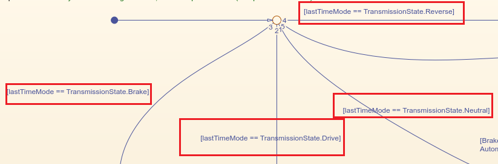

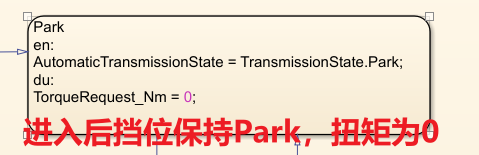

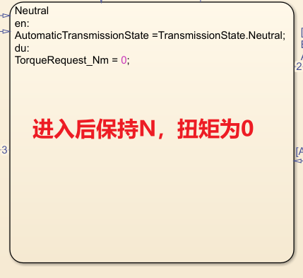

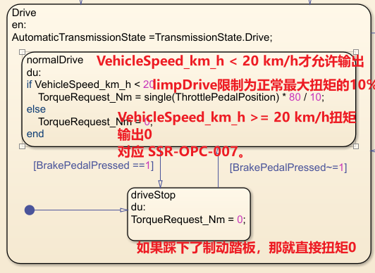

==对应 `SSR-OPC-007`==

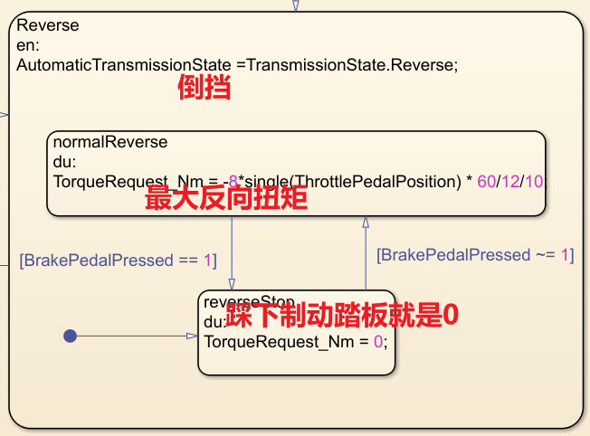

==对应 `SSR-OPC-008`==

**LimpMode内的挡位转换**

阶段3不仅根据故障前挡位进入某个Limp状态，还基本复制了原有的安全挡位转换关系。

**LimpPark → LimpNeutral**

```
[BrakePedalPressed == true && ...
 AT_SelectorState ~= TransmissionState.Park]
```

含义：

- 驾驶员踩下制动；
- 请求离开Park；
- 先进入Neutral。

**LimpNeutral → LimpPark**

```
[VehicleSpeed_km_h < 5 && ...
 VehicleSpeed_km_h > -5 && ...
 BrakePedalPressed == true && ...
 AT_SelectorState == TransmissionState.Park]
```

**LimpNeutral → LimpReverse**

```
[VehicleSpeed_km_h < 5 && ...
 BrakePedalPressed == true && ...
 AT_SelectorState == TransmissionState.Reverse]
```

更规范的写法建议使用：

```
[VehicleSpeed_km_h < 5 && ...
 VehicleSpeed_km_h > -5 && ...
 BrakePedalPressed == true && ...
 AT_SelectorState == TransmissionState.Reverse]
```

现有阶段3模型只检查了 `<5`，没有同时检查 `>-5`。

**LimpNeutral → LimpDrive**

```
[VehicleSpeed_km_h > -5 && ...
 BrakePedalPressed == true && ...
 (AT_SelectorState == TransmissionState.Drive || ...
  AT_SelectorState == TransmissionState.Brake)]
```

阶段3中故障模式没有Brake状态，因此请求Brake时也进入受限Drive。

**LimpReverse → LimpNeutral**

```
[AT_SelectorState ~= TransmissionState.Reverse]
```

**LimpDrive → LimpNeutral**

```
[AT_SelectorState == TransmissionState.Neutral]
```

如果使用 `~= Drive`，当请求挡位为 `Brake` 时条件成立，控制器反而会退出 LimpDrive、进入 Neutral，这与当前安全概念不一致。

阶段3实际模型中，LimpMode的挡位转换与正常模式非常接近，只是没有Brake状态，并且Drive扭矩与Reverse扭矩受到限制。


阶段3实际转换条件：

```
LimpMode → NoFailureDetected
```

条件：

`ThrottlePedalSensorReset` 可以把它理解成一个**故障复位请求信号**。用于请求清除故障/退出降级模式

```
[ThrottlePedalSensorReset == true]
```

==对应 `SSR-OPC-005`。==

但是，这个逻辑存在一个工程问题：如果故障仍然存在，状态机会出现：

```
收到Reset
→ 退出LimpMode
→ 下一周期检测到isFailMode仍为true
→ 再次进入LimpMode
```

更规范的条件是：

```
[ThrottlePedalSensorReset == true && ...
 isFailMode == false]
```

但如果这样修改，应当同步修改SSR，而不是只改模型。


## 单踏板模式

One Pedal，即汽车单踏板模式，指的是驾驶者可以通过一个加速踏板控制车辆的加速和减速，踩下加速踏板即加速，抬起加速踏板则是刹车。

## Requirements Toolbox使用

Requirements Toolbox 中的“[Requirements Table](https://zhida.zhihu.com/search?content_id=255813068&content_type=Article&match_order=1&q=Requirements+Table&zhida_source=entity)为工程师提供用于正式需求编写和分析的可读格式，同时保持可追溯性。

需求表中的**每一行都表示一个需求**。需求通常包括：

**“前提条件 – 后置条件”需求**，通常用于定义故障检测、故障缓解和模式逻辑的行为。此需求类型的一个示例是“当来自多个传感器的数据无效时，控制系统应启用回归模式”，其中前提条件是多个传感器无效时，**后置条件是启用回归模式**，动作时“回归模式的内容细节”。

**禁止性”需求**，通常用于定义安全要求。此需求类型的一个示例是 “当飞机在地面上且起落架轮滚动时，[推力反向器](https://zhida.zhihu.com/search?content_id=255813068&content_type=Article&match_order=1&q=推力反向器&zhida_source=entity)不得展开”。**“不得”约定对于“禁止性”要求很常见。**

- **前提条件** – 一个布尔表达式，在评估其余需求之前，必须在**指定的持续时间**内为 **true**。
- **后置条件** - 一个布尔表达式，如果**关联的前提条件**在**指定的持续时间**内为 **true**，则该表达式**必须为 true。**
- **Duration （持续时间）** – 一个可选时间（以秒为单位），在此期间，**在评估其余需求之前，前提条件必须为 true。**
- **Action （动作）** – 如果关联的前提条件在指定持续时间内为 true，则块将执行的可选作。这可用于**定义需求表的输出**，这在构建包含级联需求表的规范模型时非常有用。


需求编写使用 MATLAB® 语法在需求表中表达形式化需求，需求也可能具有层次结构，例如父子。

Requirements Table 的目标是提供一种更易理解的方法来编写形式化需求。**本文中描述的规范模型使用 “precondition-postcondition” 格式。**

1.打开

启动 MATLAB，在顶部操作：

```
应用程序 Apps
→ Verification, Validation, and Test
→ Requirements Editor
```

如果找不到，在 MATLAB 命令窗口输入：

```
slreq.editor
```

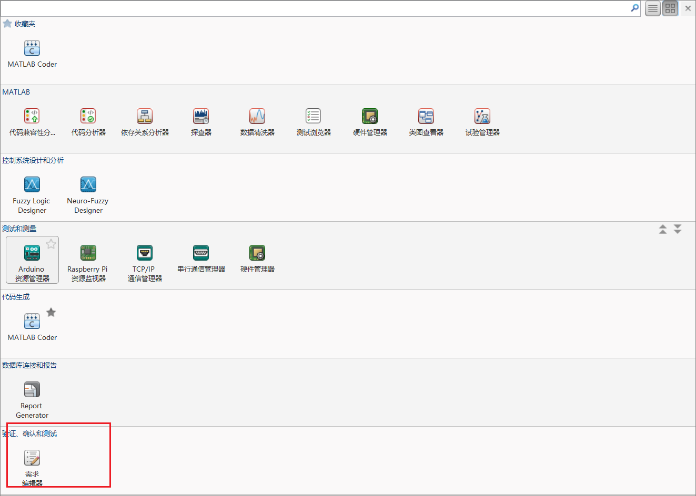
